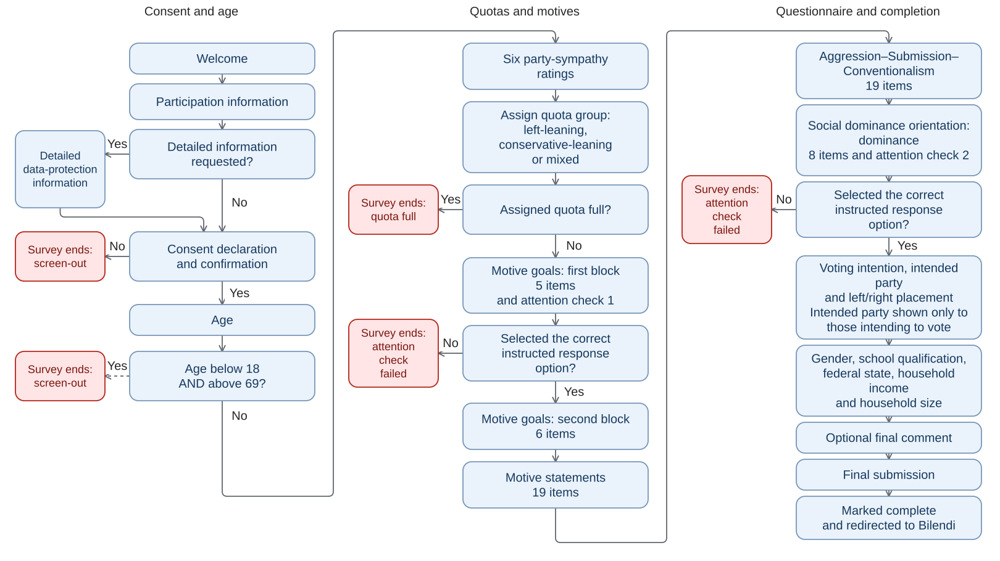
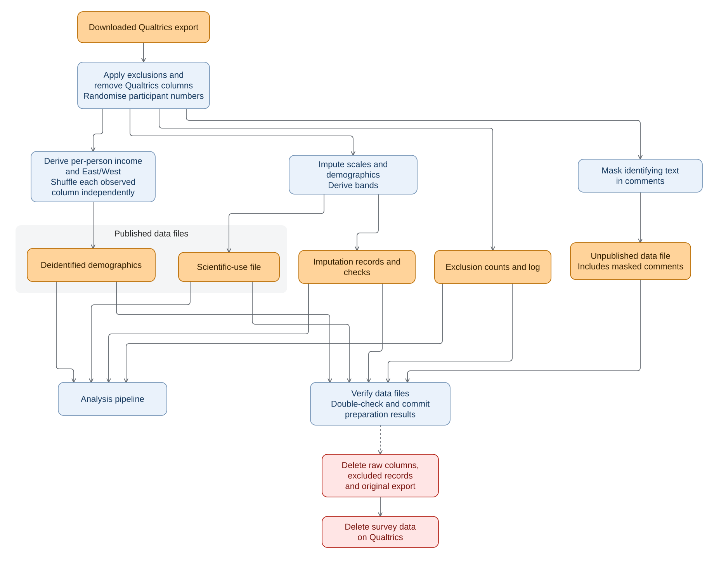

::: {.content-visible unless-format="pdf"}
[Methods and results on synthetic data](../../analysis/report/results_draft.html)
:::

::: {.content-visible when-format="pdf"}
[Methods and results on synthetic data](results-report.pdf)
:::

# Frontmatter

## T1 — Title {.unnumbered .unlisted}

Motives and Ideology: Bischof's Zürich Model of Social Motivation, Right-wing Authoritarianism and Social Dominance Orientation

## T2 — Contributors {.unnumbered .unlisted}

Michael Zehetleitner^\*^ — <https://orcid.org/0000-0003-3363-2680>\
Chiara Castiglione^\*^ — <https://orcid.org/0009-0009-5005-5054>\
Jana Drastik^\*^ — <https://orcid.org/0009-0001-3055-4384>\
Delilah Matterstock^\*^ — <https://orcid.org/0009-0004-0627-1802>\
Nicolas Prell^\*^ — <https://orcid.org/0009-0006-3569-979X>

^\*^ General Psychology, Catholic University Eichstätt-Ingolstadt, Germany



### Contributor Roles Taxonomy (CRediT) {.unnumbered .unlisted}

This CRediT matrix (@tbl-credit) describes the contributions to this preregistration.

| CRediT role | MZ | CC | JD | DM | NP |
|------------------|--------|--------|--------|--------|--------|
| Conceptualization | Lead | Supporting | Supporting | Supporting | Supporting |
| Data curation | Lead | Supporting | Supporting | Supporting | Supporting |
| Formal analysis | Lead | Supporting | Supporting | Supporting | Supporting |
| Funding acquisition | Lead | — | — | — | — |
| Investigation | Equal | Equal | Equal | Equal | Equal |
| Methodology | Supporting | Equal | Equal | Equal | Equal |
| Project administration | Lead | — | — | — | — |
| Resources | Lead | Supporting | Supporting | Supporting | Supporting |
| Software | Lead | — | — | — | Supporting |
| Supervision | Lead | — | — | — | — |
| Validation | Lead | Supporting | Supporting | Supporting | Supporting |
| Visualization | Lead | Supporting | Supporting | Supporting | Supporting |
| Writing – original draft | Equal | Equal | Equal | Equal | Equal |
| Writing – review & editing | Lead | Supporting | Supporting | Supporting | Supporting |

: Contributions to this preregistration by CRediT role. {#tbl-credit}

*Note.* MZ = Michael Zehetleitner, CC = Chiara Castiglione, JD = Jana Drastik, DM = Delilah Matterstock, NP = Nicolas Prell.

## T3 — Date of Preregistration {.unnumbered .unlisted}

[exact submission date], 2026

## T4 — Versioning Information {.unnumbered .unlisted}

Version 1.0. This is the first published version of the preregistration.

## T5 — Identifier {.unnumbered .unlisted}

N.A. at submission; a persistent identifier will be assigned by PsychArchives.

## T6 — Estimated Duration of Project {.unnumbered .unlisted}

1 June to 31 December 2026

## T7 — IRB Status {.unnumbered .unlisted}

The study is covered by approval from the ethics committee of the Catholic University Eichstätt-Ingolstadt, ID 056-2021.

## T8 — Conflict of Interest Statement {.unnumbered .unlisted}

The contributors declare no conflicts of interest.

## T9 — Keywords {.unnumbered .unlisted}

Zürich model of social motivation; social motives; right-wing authoritarianism; authoritarian aggression; authoritarian submission; conventionalism; social dominance orientation; Bayesian regression; Bayesian network

## T10 — Data, Code and Materials Availability {.unnumbered .unlisted}

Code, study materials and documentation will be made available via PsychArchives and [GitHub](https://github.com/michaelzehetleitner/social-motives-ideology). The analysis code for this preregistration is available in a [fixed repository snapshot](https://github.com/michaelzehetleitner/social-motives-ideology/tree/db10145b8539e97b677eeebcb3706f6f60d63907). The dataset will be made available for scientific use via PsychArchives. Respondents selecting divers for gender are excluded from it if less than 30 persons did so. The demographic variables of the scientific-use dataset will be gender, age band and income band per household member, as used in the analyses (AP3). The scientific-use dataset also includes the six party-sympathy ratings and vote intention.

Also for scientific use, there is a dataset with the observed values of exact age, income per household member, school education, East/West and response duration. Each column is shuffled independently, without participant numbers.

# Abstract

## A1 — Background

The present study examines links between social motives from Bischof's Zürich model of social motivation and right-wing authoritarianism and social dominance orientation. It covers five motives from the model's three systems: security, arousal, power, prestige, and achievement. Their associations with four facets of authoritarian orientation are estimated: authoritarian aggression, authoritarian submission, conventionalism, and the dominance facet of social dominance orientation.

## A2 — Objectives and Research Questions

**RQ1:** Which motives are associated with each facet of authoritarian orientation, conditional on the other motives and demographics? Four separate Bayesian regressions answer this question, one per authoritarian facet.

**RQ2a:** How do each social motive’s associations differ in strength and direction across the four authoritarian facets, conditional on the other motives and demographics?

**RQ2b:** How are the four authoritarian facets, and the ASC total and SDO-D, associated before and after conditioning on the social motives and demographics?

**RQ2c:** How does each social motive’s association with the ASC total differ in strength and direction from its associations with authoritarian aggression, authoritarian submission, and conventionalism? A joint Bayesian regression of the four authoritarian facets answers all three questions, retaining the predictor set of RQ1.

**RQ3:** Which associations between sets remain after conditioning on every other variable in the network? A Bayesian network of the five motives and four facets answers RQ3a–RQ3c.

**RQ3a:** Which associations bridge the social-motive and authoritarian-orientation sets?

**RQ3b:** Are power, prestige, and achievement positively associated with the arousal motive and negatively associated with the security motive, when the remaining network variables are held constant?

**RQ3c:** Which ASC facets remain associated with SDO-D, conditional on the remaining facets and social motives?

**SRQ1:** How distinctly are the five social motives and the four facets of authoritarian orientation represented when their complete item sets are examined together? Exploratory and confirmatory factor analyses provide complementary evidence for this question.

These analyses describe associations in cross-sectional data and do not establish causal direction.

## A3 — Participants

Participants were recruited via a German Bilendi online panel. Fieldwork from 19 to 24 June 2026 yielded 700 billed participations across three political-leaning quota groups used to balance sampling. The number of analysable cases follows from the preregistered exclusions.

## A4 — Study Method

The study used a cross-sectional online self-report design. Authoritarian aggression, authoritarian submission, and conventionalism were measured with the Aggression–Submission–Conventionalism scale [ASC\; @dunwoodyAggressionSubmissionConventionalismScaleTesting2016], and group-based dominance with the eight dominance items (SDO-D) of Social Dominance Orientation scale version 7 [SDO7\; @hoNatureSocialDominance2015]. The security motive and achievement were assessed with the six-item intimacy and achievement subscales of the Unified Motive Scales [UMS-6\; @schonbrodtIRTAnalysisMotive2012], the arousal motive with a study-specific six-item social-neophilia scale, and the power motive and prestige with the dominance and prestige subscales of the six-item Dominance, Prestige, and Leadership measure [DoPL-6\; @suessenbachDominancePrestigeLeadership2019].

# Introduction

## General Theoretical Overview

The present study links authoritarian orientation to five social motives—security, arousal, power, prestige, and achievement—described in Bischof's [-@bischofUntersuchungenZurSystemanalyse1993; -@bischofPsychologieGrundkursFuer2008; -@bischofStrukturUndBedeutung2016] Zürich model of social motivation.

### Authoritarian Orientation and Study Outcomes

We investigate four aspects of authoritarian orientation: authoritarian aggression, authoritarian submission, conventionalism, and social dominance. Authoritarian aggression and authoritarian submission were first described by Fromm (1936/1987) as the sadistic and the masochistic strivings of the authoritarian character; Adorno, Frenkel-Brunswik, Levinson, and Sanford (1950) defined both, together with conventionalism, as variables of the F scale. These components are central to the right-wing authoritarianism (RWA) tradition, especially Altemeyer (1981, 1996), who conceptualised RWA as the covariation of authoritarian aggression, authoritarian submission, and conventionalism. Frenkel-Brunswik's contribution to Adorno et al. (1950) described support for a hierarchical, rather than equalitarian, conception of human relations as part of the authoritarian personality (p. 327). A central contemporary construct for this hierarchy-related facet is social dominance orientation [SDO\; @prattoSocialDominanceOrientation1994]. RWA and SDO are the central elements of the dual-process motivational model, which treats them as distinct but related ideological attitude dimensions [@duckittDualprocessCognitivemotivationalTheory2001; @duckittPersonalityIdeologyPrejudice2010].

Authoritarian aggression refers to the endorsement of intentional harm or coercion against persons or groups when such behaviour is perceived as serving legitimate authority or preserving social order. Authoritarian submission refers to trust in, obedience to, and deference toward established authorities. Conventionalism refers to the endorsement and preservation of social norms, traditions, and conventional standards. Social dominance orientation refers to a general preference for hierarchical rather than equal relations between social groups [@prattoSocialDominanceOrientation1994]; its dominance facet refers to a preference for group-based dominance hierarchies in which dominant groups actively oppress subordinate groups [@hoNatureSocialDominance2015].

We use the term authoritarian orientation for the combination of the three RWA facets and SDO together. This use is consistent with Radkiewicz's [-@radkiewiczSocialCompetitiveThreat2022] treatment of RWA and SDO as two facets corresponding to submissive and dominative forms of authoritarianism. Radkiewicz uses the term ideology; however, ideologies are frequently understood as doctrinal and socially articulated sets of beliefs.

The study analyses authoritarian aggression, authoritarian submission, conventionalism, and the dominance facet of social dominance orientation (SDO-D) separately. The first three are measured with the Aggression–Submission–Conventionalism scale [ASC\; @dunwoodyAggressionSubmissionConventionalismScaleTesting2016]. The administered German ASC version splits one published double-barrelled conventionalism item into two items. SDO-D is measured with a study-specific German translation of the eight dominance items from the Social Dominance Orientation scale version 7 [SDO7\; @hoNatureSocialDominance2015], using a six-point agreement response scale.

### The Zürich Model and Study Predictors

Bischof's Zürich model of social motivation [@bischofSystemsApproachFunctional; @gublerSystemsTheoryPerspective1991; @bischofUntersuchungenZurSystemanalyse1993; @bischofPsychologieGrundkursFuer2008; @bischofStrukturUndBedeutung2016] treats social motivation as a cybernetic control system. Behaviour is regulated through discrepancies between a reference level and the current level. The reference level is set by the need or motive; the discrepancy is the current motivational state [@bischofPsychologieGrundkursFuer2008, p. 323]. When the current level matches the reference level, there is no discrepancy and no motivated behaviour results. A current level below the reference level produces motivational appetence, an approach tendency; a current level above it produces motivational aversion, an avoidance tendency [@bischofMoralIhreNatur2020, pp. 395–396; @zygarMotiveDispositionsStates2018a, pp. 308–309]. The model distinguishes three interrelated social motive systems: the security system, the arousal system, and the autonomy system.

The Zürich model’s motive systems have close counterparts in motivational psychology. Security connects with attachment to particular figures and the security afforded by these bonds [@bowlbyMakingBreakingAffectional1977], and with research on appetence and aversion concerning closeness and distance [@hagemeyerAbcSocialDesires2013a]. Arousal connects with novelty, curiosity and exploration [@berlyneConflictArousalCuriosity1960], including positive stimulation as a distinct incentive for social contact [@hillAffiliationMotivationPeople1987]. Power connects with the established power-motive tradition [@mcclellandPowerInnerExperience1975]. The distinction between power and prestige parallels the distinction between coercive dominance and freely conferred deference [@henrichEvolutionPrestigeFreely2001a]. Achievement connects with theories of striving for success and avoiding failure, where behaviour depends on motive strength, expectations and incentives [@atkinsonMotivationalDeterminantsRisktaking1957].

Reference levels and feedback also connect the model with general theories of self-regulation [@carverControlTheoryUseful1982]. For the present study, Bischof’s contribution is to organise these motivational themes within a common cybernetic framework and specify the interrelations of the security, arousal and autonomy systems [@bischofPsychologieGrundkursFuer2008].

Familiarity is the central concept for the arousal and security systems. The more contact one has with an individual, the more familiar this individual becomes. But prolonged contact is not the only source of familiarity. Individuals never met before can also be familiar based on similarity, which in turn allows identification, the basis of group formation. Indicators of similarity are the same culture, the same language, and shared norms and customs. Familiarity, according to Bischof, has not only a social aspect but also an epistemic aspect. The more known and predictable the situation is, the higher familiarity becomes. On the other hand, the more unpredictable or unknown the situation is, the lower familiarity becomes.

The security system regulates behaviour toward familiar social others. The current level of security increases with the familiarity, relevance, and proximity of a social object. Its reference level is set by the security motive (need for security), which Bischof calls dependency, that is, the degree to which the person requires security, closeness, and reassurance. When current security falls below this reference level, motivational appetence for security motivates attachment, approach, bonding, and protection seeking. When current security exceeds the reference level, motivational aversion arises and produces surfeit, withdrawal from or conflict with familiar others.

The arousal system regulates behaviour toward social novelty, especially unfamiliar social others. The current level of arousal increases with the unfamiliarity and proximity of a social object and the unpredictability of the situation. Its reference level is set by the arousal motive (need for arousal), which Bischof calls enterprise. When current arousal falls below the reference level, motivational appetence for arousal produces curiosity and promotes social exploration and approach. Bischof describes a feedback path here: contact with the unfamiliar in turn increases its familiarity and thereby lowers current arousal. When current arousal exceeds the reference level, motivational aversion produces fear, withdrawal, and avoidance.

The security and the arousal system are similar in that their current levels are both determined by proximity and familiarity; only the polarity of familiarity differs. The closer a social object, the higher both current levels. The more familiar it is, the higher the current level of security and the lower the current level of arousal. The security system thus regulates distance to the familiar, the arousal system distance to the unfamiliar. The two systems are nevertheless not the two poles of one dimension, because their reference levels, dependency and enterprise, vary independently of each other: a person can have a strong security motive and a strong arousal motive, or weak ones.

The autonomy claim is the central reference level of the autonomy system. It is linked to competence, agency, social rank, strength, self-assertion, and social respect. In Bischof's model [-@bischofPsychologieGrundkursFuer2008; -@bischofStrukturUndBedeutung2016], autonomy claim is differentiated into three independent aspects: the power motive, the prestige motive, and the achievement motive. Current power, current prestige, and current achievement are then compared against the reference levels of the respective motives. When a current level falls below its reference level, motivational appetence promotes striving for what satisfies the respective motive: the submission of others for power, applause, respect, and admiration for prestige, and reaching one's own goals and the awareness of one's own competence for achievement. When a current level exceeds its reference level, motivational aversion promotes submission or conflict avoidance for power, and not being seen or not standing out for prestige. For the achievement motive, aversion could be underachieving. For power, prestige, and achievement, the connecting variable is whether self-worth depends on others. Both power and prestige require interaction with and feedback from social others, whereas the achievement motive is a kind of self-worth independent of social feedback. The autonomy claim also affects the reference levels of the other two systems: a higher autonomy claim raises the reference level of the arousal system and lowers that of the security system. Bischof does not specify which of the three aspects carries this effect.

The study does not measure the reference levels of the Zürich model directly. It uses five measured social motives as proxies for the three motive systems: UMS-6 intimacy for the security motive and UMS-6 achievement for the achievement motive [@schonbrodtIRTAnalysisMotive2012], DoPL-6 dominance for the power motive and DoPL-6 prestige for the prestige motive [@suessenbachDominancePrestigeLeadership2019], and a study-specific social-neophilia scale for the arousal motive.

The items of these five measures ask for the importance of goals, for wishes, for affective reactions, for typical behaviour toward the respective social objects, and for beliefs. These scales are proxies for the motive systems, not operationalisations of them: with the exception of the social-neophilia scale, they were not built for the Zürich model and do not differentiate between the motive, which sets the reference level, the current level, the motivational state, and the resulting behaviour. Because a strong motive makes an appetent motivational state, and thus appetent behaviour, more probable, the scales are used as indicators of motive strength.

## Theoretical Rationale for the Present Study

In the dual process motivational model of ideology and prejudice
[@duckittDualprocessCognitivemotivationalTheory2001; @duckittPersonalityIdeologyPrejudice2010], motivational goals mediate between social worldviews and social ideological attitudes such as RWA and SDO. The present study relates five social motives to four facets of authoritarian orientation.

### Why Analyse the Authoritarian-Orientation Facets Separately?

The rationale for separating the authoritarian-orientation outcomes is that a total score and its facets can relate differently to the same variable. RWA is often analysed as a total score, although the construct is theoretically composed of authoritarian aggression, authoritarian submission, and conventionalism. A total score may be useful when the research question concerns a broad authoritarian syndrome. However, it is less informative when the question concerns whether different motivational systems relate differently to the component facets. A total score represents an aggregate across facets, so its association with a motive combines the facets' associations with that motive. For example, a motive may be positively associated with authoritarian aggression but weakly, negatively, or not at all associated with authoritarian submission or conventionalism. In such a case, the total score can show no association although facets are associated with the motive in opposite directions; it can show an association weaker than that of the most strongly associated facet; or it can show an association of one sign while one facet's association has the other sign. When all facets are associated with the motive in the same direction, the total score's association can also be stronger than that of any single facet. And one and the same total-score association can arise from facets with equal associations and from facets whose associations differ in size or sign.

The concern that a total score and its facets can relate differently to the same variable is not only statistical but also empirical. Funke's [-@funkeDimensionalityRightWingAuthoritarianism2005] three-dimensional Right-Wing Authoritarianism scale (RWA³D) is a balanced 12-item measure of authoritarian aggression, authoritarian submission, and conventionalism, constructed by grammatically simplifying or splitting a German version of items from Altemeyer's [-@b.altemeyerAuthoritarianSpecter1996] RWA scale. In the Authoritarianism–Conservatism–Traditionalism model [ACT\; @johnduckittTripartiteApproachRightWing2010], these facets are reconceptualised as distinct social attitude dimensions, each expressing a motivational goal, and accordingly named, respectively, Authoritarianism, Conservatism, and Traditionalism. The ASC [@dunwoodyAggressionSubmissionConventionalismScaleTesting2016] likewise assesses the three components separately. Mavor et al. [-@mavorBiascorrectedExploratoryConfirmatory2010] found a three-factor solution of the full 30-item RWA scale [@b.altemeyerAuthoritarianSpecter1996], with aggression, conventionalism, and submission factors, superior to a one-factor solution. Their confirmatory model placed the three first-order factors under a second-order RWA factor, supporting distinguishable facets within a broader authoritarianism construct.

Empirical work shows that the facets can relate differently to the same variable. In Duckitt et al.'s New Zealand student sample, self-rated religiosity was negatively associated with the ACT facet Authoritarianism (the facet corresponding to authoritarian aggression) and positively associated with Traditionalism when the three ACT facets were considered together, whereas its bivariate association with the total ACT score was positive [@johnduckittTripartiteApproachRightWing2010, Table 3]. Across their samples, Dunwoody and Funke [-@dunwoodyAggressionSubmissionConventionalismScaleTesting2016] found that ASC aggression had the strongest correlation with SDO among the three ASC facets. With the RWA³D and ACT scales, by contrast, the facet most strongly correlated with SDO varied between samples (submission in four of the six results, aggression in the other two), and the three facets' correlations with SDO were more similar in size; all facets of all three scales correlated with SDO. In regressions predicting ethnocentrism, political intolerance, and anti-democratic attitudes, aggression was the strongest consistent unique predictor, while the contributions of submission and conventionalism varied by criterion.

Other criteria also relate differently to the three facets. Compared with supporters of other Republican candidates, Trump supporters were higher in group-based dominance and authoritarian aggression, but not in authoritarian submission or conventionalism [@womickGroupBasedDominanceAuthoritarian2019]. Mallinas et al. [-@stephanier.mallinasSubcomponentsRightWingAuthoritarianism2020] found that submission was associated with judging obedience to authorities as moral regardless of the authorities' ideology, whereas traditionalism—their conventionalism-related facet—was associated with judging obedience to conservative authorities as moral and obedience to liberal authorities as immoral. During New Zealand's COVID-19 lockdown, both Labour and National party support were positively associated with submission, whereas National support was positively and Labour support negatively associated with aggression and conventionalism [@winterLeftwingSupportAuthoritarian2022].

The present study therefore analyses authoritarian aggression, authoritarian submission, conventionalism, and SDO-D separately rather than relying on a single authoritarianism total score.

### Why Analyse Social Motivation According to the Zürich Model?
@tbl-ideological-orientations shows definition and corresponding goals of the relevant attitudinal components.

+------------------------------+-------------------------------------------------------------+-------------------------------------------------+
| Orientation or facet         | Attitudinal definition                                      | Corresponding motivational goal                 |
+==============================+=============================================================+=================================================+
| *Broad ideological orientations*                                                                                                             |
+------------------------------+-------------------------------------------------------------+-------------------------------------------------+
| RWA                          | “Tendency to submit to authorities, aggress against norm    | “Social control to enforce order, stability,    |
|                              | violators and support conventions”^a^                       | security and traditional lifestyles”^a^         |
+------------------------------+-------------------------------------------------------------+-------------------------------------------------+
| SDO                          | “Preference for group-based hierarchy and inequality”^a^    | “Power, dominance and superiority over          |
|                              |                                                             | others”^a^                                      |
+------------------------------+-------------------------------------------------------------+-------------------------------------------------+
| *Facets of RWA in the ACT model*                                                                                                             |
+------------------------------+-------------------------------------------------------------+-------------------------------------------------+
| Authoritarianism\            | “attitudinal beliefs favouring the use of strict, tough,    | “maintaining coercive social control”^b^        |
| (authoritarian aggression)   | harsh, punitive, coercive social control”^b^                |                                                 |
+------------------------------+-------------------------------------------------------------+-------------------------------------------------+
| Conservatism\                | “attitudes favouring uncritical, respectful, obedient,      | “maintaining social order, harmony, cohesion,   |
| (authoritarian submission)   | submissive support for existing societal or group           | and consensus in society or the collective”^b^  |
|                              | authorities and institutions”^b^                            |                                                 |
+------------------------------+-------------------------------------------------------------+-------------------------------------------------+
| Traditionalism\              | “attitudes favouring traditional, old fashioned social      | “maintaining traditional lifestyles, norms, and |
| (conventionalism)            | norms, values, and morality”^c^                             | morality”^c^                                    |
+------------------------------+-------------------------------------------------------------+-------------------------------------------------+

: Ideological orientations, attitudinal definitions, and corresponding motivational goals. {#tbl-ideological-orientations tbl-colwidths="21,44,35"}

*Note.* Definitions and goals are quoted verbatim. ^a^ Osborne et al. [-@osbornePsychologicalCausesSocietal2023, p. 222]. ^b^ Duckitt et al. [-@johnduckittTripartiteApproachRightWing2010, p. 690]. ^c^ Duckitt et al. [-@johnduckittTripartiteApproachRightWing2010, p. 691].

Several facet-specific motivational goals closely overlap in content with their corresponding attitudes. The group-cohesion account nevertheless explains the components’ covariation through a shared motivational concern [@dunwoodyAggressionSubmissionConventionalismScaleTesting2016, p. 573]. The present study instead relates authoritarian orientation to motives that are more general than the attitudes and whose theoretical definitions were developed independently of them. The motives of the Zürich model regulate social behaviour in general, that is, the distance to familiar and to unfamiliar others and the striving for power, prestige, and achievement, without reference to political or ideological attitudes. Their associations with the facets of authoritarian orientation therefore have to be derived through mechanisms with intermediate steps. For example, a stronger security motive strengthens the need for identification with the in-group; conformity with the group's norms supports this identification, so the security motive is expected to be positively associated with conventionalism. The theoretical predictions for RQ1 derive each motive–facet association in this way.

To our knowledge, no study has examined this combination of five social motives of the Zürich model in relation to separated authoritarian-orientation facets while considering the motives together. Considering the motives together matters because the Zürich model treats the motive systems as theoretically interrelated. Associations estimated for one motive in isolation may reflect that motive specifically, but they may also reflect variance shared with adjacent motives and may weaken, disappear, or change sign once adjacent motives are entered in the same model. The regression models therefore estimate adjusted associations: each motive is related to each authoritarian-orientation facet while the other motives and covariates are included in the model.

Previous research has examined constructs adjacent to the security system, social exploration, and the autonomy motives [@steckerFeelingThreatenedMiddle2025; @perryDangerousCompetitiveWorldviews2013; @kleppestoAttachmentPoliticalPersonality2024; @sibleyPersonalityPrejudiceMetaAnalysis2008; @desimoniOpennessExperienceHonesty2014; @akramiRightWingAuthoritarianismSocial2006; @suessenbachDominancePrestigeLeadership2019; @zeigler-hillFundamentalSocialMotives2019; @heavenRightwingAuthoritarianismSocial2001; @cohrsMotivationalBasesRightWing2005; @grigoryevAuthoritarianAttitudesRussia2022; @schonbrodtIRTAnalysisMotive2012]. The measures used in these studies do not provide direct equivalents of the present intimacy and social-neophilia scales; the DoPL dominance and prestige subscales are the closest precedents for power and prestige, while the reviewed achievement measures include adjacent constructs. The detailed assessment of the measures and their findings is presented in RQ1's qualified generalisation expectations subsection.

# Research Questions and Predictions {#objectives-and-research-questions-draft}
## Summary
The study examines adjusted motive–facet associations (RQ1), differences between these associations and correlations among authoritarian facets (RQ2), conditional network associations (RQ3), and item-set dimensionality and correspondence (SRQ1).

- **RQ1:** Which motives are associated with each facet of authoritarian orientation, conditional on the other motives and demographics?

- **RQ2a:** How do each social motive’s associations differ in strength and direction across the four authoritarian facets, conditional on the other motives and demographics?

- **RQ2b:** How are the four authoritarian facets, and the ASC total and SDO-D, associated before and after conditioning on the social motives and demographics?

- **RQ2c:** How does each social motive’s association with the ASC total differ in strength and direction from its associations with authoritarian aggression, authoritarian submission, and conventionalism?

- **RQ3:**  Which associations between sets remain after conditioning on every other variable in the network?

- **RQ3a:** Which associations bridge the social-motive and authoritarian-orientation sets?

-  **RQ3b:** Are power, prestige, and achievement positively associated with the arousal motive and negatively associated with the security motive, when the remaining network variables are held constant?

- **RQ3c:** Which ASC facets remain associated with SDO-D, conditional on the remaining facets and social motives?

- **SRQ1:** How distinctly are the five social motives and the four facets of authoritarian orientation represented when their complete item sets are examined together?

In the present preregistration the confirmatory/exploratory distinction [@wagenmakersAgendaPurelyConfirmatory2012] is differentiated into two independent levels: (i) preregistered predictions versus (ii) preregistered analysis plans.
Consequently, analyses which have no predictions (for instance because there are no theories with the adequate granularity) but a preregistered analysis plan are not considered exploratory in the normatively negative sense that Wagenmakers et al. argue against. Analyses with a preregistered analysis plan but no predictions are part of the context of discovery [@reichenbachExperiencePredictionAnalysis1938; @popperLogikForschung1935; @popperLogicScientificDiscovery1959] and aim at establishing empirical phenomena.

The following subsections describe each research question: rationale and objective, psychological question, statistical method, evidence measures, what results answer the question, theoretical predictions or expectations, qualified generalisation expectations, and open questions.

## RQ1 — Social Motives and Authoritarian Facet Associations {#rq1-draft}

### Rationale and Objective

The overarching question of the study is how the social motives predict authoritarian orientation. RQ1 answers it for each facet separately. Facet-specific associations can be obscured when authoritarian orientation is treated as a single score. Associations estimated for one social motive alone may also partly reflect its associations with other motives. Each motive's association with a facet is therefore estimated while the other motives, age, gender and income are held constant. When two motives overlap strongly, the data can hardly show which of the two carries an association with a facet; comparing their coefficients directly shows whether one is more strongly associated with the facet than the other.

### Psychological Question

RQ1: Which motives are associated with each facet of authoritarian orientation, conditional on the other motives and demographics?

### Statistical Method

RQ1 is answered by four separate Bayesian regressions, one per authoritarian-orientation outcome (AP6). Each social-motive predictor’s regression coefficient describes its association with the designated outcome conditional on the other four social-motive predictors, age, gender, and income. Within each regression, the difference between the coefficients of two social-motive predictors is calculated in every posterior draw. The partial correlations of two social-motive predictors, conditional on the other three social-motive predictors, age, gender, and income, are estimated from one joint Bayesian regression of the five social-motive scores on age, gender, and income with correlated residuals; in each posterior draw, the residual correlations are converted into partial correlations, which describe how strongly two motives overlap.

### Evidence Measure

The evidence measure is the adjusted coefficient of each of the five social-motive predictors in each of the four regressions, together with its central 95% credible interval and sign. For two social-motive predictors with opposite predicted signs for the same outcome, it is also the difference between their coefficients, with its credibility and sign. The credible partial correlations of the social-motive predictors qualify the coefficients.

### What Result Answers the Question?

The credible coefficients (AP10), with their signs and estimated sizes, answer RQ1.

A credible difference between two coefficients with opposite predicted signs answers whether the motive predicted positive is more positively associated with the outcome than the motive predicted negative. For a coefficient whose interval includes zero, a credible partial correlation of its motive with another motive indicates that the overlap of the two is possibly responsible for the interval including zero.

### Theoretical Predictions

The derivation of theoretical predictions links the outcomes of authoritarian orientation to mechanisms of Bischof's theory. It starts with zero-sum mentality, which links the power, prestige, and achievement motives to SDO-D. It then derives the paths of the security and arousal motives to SDO-D, authoritarian aggression, and conventionalism, which run through fear, the moral legitimisation of treating persons or groups badly, identification with the in-group, curiosity, and aversion against the familiar. Their paths to authoritarian submission run through neediness. The remaining paths of the power, prestige, and achievement motives follow. @tbl-predicted-signs summarises the predicted signs.

For ease of exposition, the following account is written in the indicative, conditional on Bischof's theory holding. This convention is used to describe the theory and derive predictions from it; it does not assert that the theory is true.

The links from these mechanisms to the measured authoritarian-orientation outcomes are derivations of the present study. Predicting their signs after adjustment additionally assumes that the proposed motive-specific pathways remain when the other motives and demographics are held constant.

#### Zero-Sum Mentality: Power, Prestige, and Achievement

Zero-sum mentality is related to the power, prestige, and achievement motives: the power motive sees either winning or losing, so rank and success are limited resources. For the prestige motive, the resource for respect and status is not mutually exclusive: two interaction partners can approve of each other and show each other respect, which raises the current level of prestige for both [@bischofMoralIhreNatur2020, pp. 440–441]. A person whose motive is satisfied in such exchanges experiences social interaction as a source of mutual gain, which weakens the belief that one person's gain is another's loss. For the achievement motive, this route assumes that success is evaluated against one's own standards; success consists in one's own competence and in creating value, which takes nothing from others. The present derivation assumes that the stronger the power motive, the stronger the zero-sum belief, whereas a stronger prestige or achievement motive weakens that belief. Social dominance theory describes people high in SDO as believing that the world is a zero-sum game and as desiring power [@prattoSocialDominanceTheory2006, p. 304]. In the dual-process model, people low in Agreeableness view the social world as a competitive jungle, value power, and are more likely to perceive competitive situations as zero-sum; over time, viewing the social world as competitive raises the motivation for group-based dominance indexed by SDO [@sibleyPersonalityPrejudiceMetaAnalysis2008, p. 252]. Thus, a positive association of power with SDO-D and a negative association of achievement with SDO-D can be derived; for prestige, a negative association with SDO-D can be derived from this route.

#### Security and Arousal

The following derivations draw on the security and the arousal system. The security system concerns familiarity, identification and within-group cohesion. The arousal system concerns unfamiliarity, strangeness, and the otherness of groups and individuals.

The background is that security and arousal are not opposite poles of one dimension and can occur in different combinations. A person could have a weak arousal motive and a weak security motive, which would lead to being alone, because contact with strangers is inhibited by fear and contact with familiars by security aversion. Both could be strong which would lead to strong exploration and strong attachment behaviour, oscillating between strangers and familiars.

##### Norm Adherence and Surfeit

The stronger the security motive, the stronger the need for identification with persons in the in-group. Conformity with the group's norms supports this identification. So a positive association of the security motive with conventionalism can be derived. Norm violations threaten identification and within-group cohesion. The wish to preserve both makes sanctions against norm-violators more attractive. Thus, a positive association of the security motive with authoritarian aggression can be derived.

The stronger the arousal motive, the stronger the curiosity about unfamiliar practices and actions. This makes strict adherence to familiar norms and conventions less attractive. So a negative association of the arousal motive with conventionalism can be derived.

A weak security motive makes aversion to familiar customs and practices more probable.

There are thus two separate sources for breaking norms: one from the arousal system via curiosity (approach) towards the unfamiliar, and one from the security system via surfeit (avoidance) of the familiar.

##### Fear and Moral Legitimisation of Harm

Authoritarian aggression and SDO is related to behaviour directed towards other people that harms or disadvantages them. Such (anti-social) behaviour can be inhibited by guilt about the harm inflicted on others. Moral legitimisation can weaken this inhibition by presenting the harm as justified, for example as defending the group or enforcing its norms.

The security system with its need for identification is assumed to favour defending group identity. The further step to authoritarian aggression and SDO-D assumes that perceived threats to group identity are judged to justify sanctions against norm-violators or unequal treatment of out-groups [@bischofMoralIhreNatur2020, p. 548]. So positive associations of the security motive with both SDO-D and authoritarian aggression can be derived.

A low arousal motive leads to high fear of strangers, where both norm-violators and out-groups can induce that fear. A high arousal motive by contrast increases curiosity towards strangers, which leads to more contact which in turn reduces the strangeness. This contact can be directed both to norm-violators and out-groups.

The fear of strangers allows guilt about treating out-groups badly to be reduced by alienation. So the mechanism of alienation and its inhibiting effect on guilt about treating others badly is more easily available for a low arousal motive, both towards norm-violators and towards out-groups, and less available for a high arousal motive. Given that alienation can make punishment of norm-violators easier, the stronger the arousal motive, the lower the approval of such punishment. A negative association between the arousal motive and authoritarian aggression can therefore be derived. A negative association of the arousal motive with SDO-D can also be derived.

##### Neediness

The security and arousal systems also provide routes to authoritarian submission through neediness.

For authoritarian submission one relevant concept is neediness. A higher neediness makes appeal to authorities more probable.  For the security system, this route assumes that a stronger need for identification makes threats to group identity more consequential and increases the need for reassurance and protection by an authority. For the arousal system, a stronger arousal motive favours curiosity rather than fear towards unfamiliar others, making protection by an authority less necessary. Taken together, a positive association of the security motive with authoritarian submission and a negative association of the arousal motive with authoritarian submission can be derived.

#### Authority over the Group: Power

The stronger the power motive, the stronger the wish to assert oneself and to get one's own way in the group. The higher the power motive, the stronger the wish to set goals for the in-group. Norm-violators threaten the goals the person has set for the in-group. Thus, a positive association of the power motive with authoritarian aggression can be derived.

A stronger power motive increases the interest in attaining and maintaining authority over the group. Norm violations can challenge an authority’s claim to set and enforce group rules, making punishment of norm-violators more attractive. The same interest supports the expectation that all group members should adhere to established norms. Here we assume that a person who wants authority over the group sees the norms and traditions assessed by the conventionalism items as helping to maintain that authority, and therefore wants group members to follow them. Thus, a positive association of the power motive with conventionalism can be derived. The conventionalism items do not specify whether respondents mean their own adherence to norms and traditions or the adherence they expect of others.

The power motive also concerns the person’s own willingness to submit to authorities. Also the stronger the power motive, the higher the willingness to enter conflict with authorities; from this, a negative association with authoritarian submission can be derived.

#### Prestige

Prestige also permits influence over the group: through mood transmission and imitation, the attention directed towards the admired person channels group behaviour in that person's interest [@bischofTheoretischePsychologieWorauf2026, p. 482].

Whether this influence favours the measured authoritarian attitudes depends on what gains approval in the group.

The prestige motive, as the motive to gain approval from one's group, is content-free. A group can share progressive or traditional norms. In both cases, norm violations can lead to the wish to be seen sanctioning norm-violators or adhering to the group's progressive or traditional conventions. The items for conventionalism and authoritarian aggression, however, have clearly traditional and authoritarian content and no progressive content. It is therefore not known whether a person with a strong prestige motive would also endorse sanctions against violators of progressive norms. Likewise, in a progressive group a strong prestige motive could lead to pressure to adhere to progressive norms, while the person would still score low on the conventionalism items. If a person's group approves of group hierarchy, a positive association of the prestige motive with SDO-D can be derived; together with the negative link through the weakened zero-sum belief, the direction of the association with SDO-D is open. No direction can be derived for authoritarian submission because gaining approval from one’s group may require following an authority or challenging one. For this reason, no direction is predicted for prestige.

#### Independence from Social Approval: Achievement

The remaining achievement predictions follow from the assumed independence of self-worth from social approval. The first route assumes that achievement motivation reduces the importance of social appreciation or recognition. Given that the sanctions for violating conventions are retraction or withdrawal of appreciation and disapproval, a negative association of achievement motivation with conventionalism can be derived.

For achievement motivation, self-worth independent of social recognition or approval is assumed to facilitate the form of identification that Bischof calls "spiegelnde Identifikation" [@bischofMoralIhreNatur2020, pp. 414–415] which allows the recognition that adherents to different norms or members of other groups have the same needs for identification and moral values. This mirroring identification allows respect; from this, negative associations of achievement motivation with conventionalism and authoritarian aggression can be derived.

Also moral judgements and attitudes become independent of authorities, so that an unquestioning trust in authorities is less pronounced. From this, a negative association of achievement motivation with authoritarian submission can be derived.

#### Summary

Positive associations of security with all four authoritarian facets can be derived, whereas negative associations can be derived for arousal and achievement. For power, positive associations with conventionalism, authoritarian aggression, and SDO-D, and a negative association with authoritarian submission can be derived. For prestige, no single direction is derived.

For RQ1, @tbl-predicted-signs gives the expected signs of the adjusted associations between the five social motives and the four aspects of authoritarian orientation. For prestige, ± indicates that either direction is possible; no single direction is predicted.

| Social motive | Conventionalism | Authoritarian submission | Authoritarian aggression | SDO-D |
|---------------|:---------------:|:------------------------:|:------------------------:|:-----:|
| Security motive | + | + | + | + |
| Arousal motive | − | − | − | − |
| Power | + | − | + | + |
| Prestige | ± | ± | ± | ± |
| Achievement | − | − | − | − |

: Predicted signs of adjusted associations between social motivation and authoritarian orientation. {#tbl-predicted-signs tbl-colwidths="20,22,23,23,12"}

Where two motives have opposite derived signs for the same facet, a larger coefficient of the motive with the positive sign than of the motive with the negative sign follows from the signs. For authoritarian aggression, conventionalism and SDO-D, the coefficients of security and power each exceed those of arousal and achievement; for authoritarian submission, the coefficient of security exceeds those of arousal, power and achievement.

RQ1 is not aimed at a test of the Zürich model. An association in the predicted direction will not be interpreted as corroboration or as showing that the model is true. An association that does not occur as predicted will not be interpreted as falsification. This is especially important because the measures are proxies for the theoretical motives. The goal is to demonstrate that links to authoritarian orientation can be derived from complex social motive systems and to establish a differential empirical pattern that needs explaining.

### Qualified Generalisation Expectations

Predictions can not only be theoretically derived, but existing empirical patterns also allow predictions. Given that the effects are replicable and are not statistical false positives, these patterns allow the expectation that the same pattern occurs also in this study [@nosekReplicabilityRobustnessReproducibility].

Replication comes with different degrees of closeness to the original finding. There can be differences in the operationalisation of a concept, in the statistical method, and so on. The further the methodological distance from the original finding, the more this becomes a question of generalisation rather than direct replication [@lebelBriefGuideEvaluate]. Replication itself also involves generalisation to the conditions of the new study, but not every study examining generalisation is a replication [@nosekWhatReplication2020].

That is why we call these expectations qualified generalisation expectations. The idea is that we look at existing empirical patterns related to our measures and examine whether predictions can be derived from them.

#### Overview of the Reviewed Evidence

The evidence is ordered by its proximity to the present motive measures. Within each group, findings for individual authoritarian facets and SDO-D are distinguished from findings for RWA total scores and SDO without facet separation.

#### Same Scale Family

Only one of the reviewed studies examined two subscales from the scale family used here—DoPL dominance and prestige—in relation to SDO. Suessenbach et al. [-@suessenbachDominancePrestigeLeadership2019] found that higher scores on the DoPL dominance subscale were associated with higher SDO. The association with the prestige subscale was not statistically significant.

#### Correspondence Between Published Measures and Present Motives

The table groups published measures by their content-based correspondence with the five motives assessed here. “Closer” indicates greater overlap in content; equivalence with the present scales has not been established. The measures retain their published labels and theoretical levels.

The reviewed literature provides no confirmed findings for the exact measures used here, but has examined measures with varying degrees of correspondence to the present predictors, as presented in @tbl-candidate-motive-measures.

| Motive | Closer candidates | Broader or more limited candidates |
|---|---|---|
| Security | Affiliation motive; attachment security, anxiety, and avoidance | Kin-care motive; generalised trust; ethnic and ingroup identification |
| Arousal | Interpersonal connection with outgroup members; mate-seeking motive; Excitement-Seeking | Big Five Openness and Extraversion; HEXACO Openness–Curiosity |
| Power | Published DoPL dominance subscale | — |
| Prestige | Published DoPL prestige subscale; status-seeking motive | Status Importance Scale; extrinsic goal pursuit; Schwartz Achievement value |
| Achievement | IPIP and NEO-PI-R Achievement-Striving facets | Intrinsic goal pursuit |

: Candidate measures grouped by content-based correspondence with the present motives. {#tbl-candidate-motive-measures tbl-colwidths="14,43,43"}

For security, the candidates concern closeness, attachment, or belonging. Affiliation and kin care are motives, attachment measures describe attachment patterns, generalised trust is a relational belief, and group identification concerns social identity. Attachment avoidance runs in the opposite direction to closeness, while group identification concerns group belonging rather than interpersonal intimacy. None is the UMS-6 intimacy scale used here.

For arousal, each candidate captures part of social approach or novelty seeking. The personality measures describe traits, mate seeking is a motive restricted to a particular social domain, and interpersonal connection measures willingness to approach outgroup members. None clearly captures the specific combination of curiosity about and approach toward unfamiliar people assessed by the present social-neophilia scale.

Schwartz Power is excluded from the table because its definition combines social status and prestige with control and dominance over people and resources. It therefore cannot be assigned unambiguously to either power or prestige as distinguished here [@schwartzOverviewSchwartzTheory2012, pp. 5–6].

The broader prestige candidates concern status or external recognition. Schwartz Achievement is treated as prestige-adjacent because its definition includes success judged by social standards and approval; its content also overlaps with achievement [@cohrsMotivationalBasesRightWing2005; @schwartzOverviewSchwartzTheory2012].

For achievement, Achievement-Striving has relevant content but measures personality traits. Intrinsic goal pursuit is broader because it also includes relationships and community. Neither is the UMS-6 achievement scale used here.

Competitive social worldview and dangerous-world beliefs remain classified as social worldviews and are excluded from this motive-level synthesis [@duckittDualprocessCognitivemotivationalTheory2001; @duckittPersonalityIdeologyPrejudice2010]. Attitudes toward immigrant integration are also excluded.

#### Related Measures

| Motive | Used proxy | Authoritarian aggression | Authoritarian submission | Conventionalism | SDO-D | Citation |
|---|---|---|---|---|---|---|
| Security | Ethno-cultural identification | n.s. | n.s. | Positive | — | Duckitt et al. [-@johnduckittTripartiteApproachRightWing2010] |
| Security | Ethnic identification | Positive | Positive | Positive | n.s.^b^ | Grigoryev et al. [-@grigoryevAuthoritarianAttitudesRussia2022], Study 6 |
| Arousal | Big Five Extraversion | Positive / n.s. | Positive / n.s. | Positive / n.s. | n.s.^b^ | Grigoryev et al. [-@grigoryevAuthoritarianAttitudesRussia2022], Study 1 |
| Power/Prestige | Basic-value Power | Negative^a^ | Negative^a^ | Negative^a^ | Positive, n.s.^b^ | Grigoryev et al. [-@grigoryevAuthoritarianAttitudesRussia2022], Study 2 |
| Prestige | Basic-value Achievement | Negative | Negative | Negative | n.s.^b^ | Grigoryev et al. [-@grigoryevAuthoritarianAttitudesRussia2022], Study 2 |

: Reported associations with individual authoritarian facets and SDO-D. {#tbl-facet-direction-patterns tbl-colwidths="14,22,12,12,12,9,19"}

::: {.rq1-table-notes}

*Note.* For Extraversion, “Positive / n.s.” denotes positive associations for ACT and nonsignificant associations for ASC. Duckitt et al. (2010) adjusted for the other two ACT facets; the remaining entries report bivariate correlations. Rows summarise reported findings; they do not weight them by sample size, number of studies, correspondence with the present measures, or model adjustment. “n.s.” means nonsignificant and does not establish absence of an association. In Grigoryev et al.’s [-@grigoryevAuthoritarianAttitudesRussia2022] Study 2, the ACT and ASC results for Basic-value Power come from the same participants and therefore do not constitute independent replications.

^a^ All six Basic-value Power estimates were negative. Four were significant; the ACT aggression and ASC conventionalism correlations were n.s.

^b^ The corresponding SDO opposition-to-equality facet was also nonsignificantly associated with this measure.

:::

| Motive | Used proxy | SDO^a^ | RWA total | Citation |
|---|---|---|---|---|
| Security | ECR-12 attachment anxiety | n.s. | Positive | Kleppestø et al. [-@kleppestoAttachmentPoliticalPersonality2024] |
| Security | ECR-12 attachment avoidance | Positive | n.s. | Kleppestø et al. [-@kleppestoAttachmentPoliticalPersonality2024] |
| Security | Generalised trust | Negative | Negative | Kleppestø et al. [-@kleppestoAttachmentPoliticalPersonality2024] |
| Security | Attachment security and avoidance | Negative security–religiosity chain; negative direct avoidance path^b^ | Positive security–religiosity chain; avoidance path n.s.^b^ | Roccato [-@roccatoRightWingAuthoritarianismSocial2008] |
| Security | Affiliation | Negative | Negative | Zeigler-Hill [-@zeigler-hillFundamentalSocialMotives2019] |
| Security | Kin care | Negative | Positive | Zeigler-Hill [-@zeigler-hillFundamentalSocialMotives2019] |
| Security | Ingroup identification | Positive for high-status ingroups; negative for some low-status ingroups | — | Levin and Sidanius [-@levinSocialDominanceSocial1999] |
| Arousal | Big Five Openness to Experience | Negative | Negative | Sibley and Duckitt [-@sibleyPersonalityPrejudiceMetaAnalysis2008] |
| Arousal | HEXACO Openness–Curiosity | Negative | Negative | Desimoni and Leone [-@desimoniOpennessExperienceHonesty2014] |
| Arousal | Big Five Extraversion | Very small negative association | n.s. | Sibley and Duckitt [-@sibleyPersonalityPrejudiceMetaAnalysis2008] |
| Arousal | NEO-PI-R Excitement-Seeking | Positive, n.s.^c^ | Negative, n.s.^c^ | Akrami and Ekehammar [-@akramiRightWingAuthoritarianismSocial2006] |
| Arousal | Mate seeking | Positive | n.s. | Zeigler-Hill [-@zeigler-hillFundamentalSocialMotives2019] |
| Arousal | Interpersonal connection with outgroup members | Negative ^d^ | Negative ^d^ | Zhao et al. [-@zhaoSocialDominanceOrientation2020a] |
| Power/Prestige | Schwartz power | Positive | Positive | Cohrs et al. [-@cohrsMotivationalBasesRightWing2005] |
| Prestige | Extrinsic goal pursuit | Positive | Positive | Onraet et al. [-@onraetRelationshipRightWingIdeological2013] |
| Prestige | Status seeking | Positive | Positive | Zeigler-Hill [-@zeigler-hillFundamentalSocialMotives2019] |
| Prestige | Schwartz achievement | Positive | n.s. | Cohrs et al. [-@cohrsMotivationalBasesRightWing2005] |
| Prestige | Status importance | n.s. | — | Rigoli and Mirolli [-@rigoliStatusImportanceScale2024] |
| Achievement | Intrinsic goal pursuit | Negative | n.s. | Onraet et al. [-@onraetRelationshipRightWingIdeological2013] |
| Achievement | IPIP Achievement-Striving | n.s. | n.s. | Heaven and Bucci [-@heavenRightwingAuthoritarianismSocial2001] |
| Achievement | NEO-PI-R Achievement-Striving | n.s. | n.s. | Akrami and Ekehammar [-@akramiRightWingAuthoritarianismSocial2006] |

: Reported associations with SDO and RWA total. {#tbl-direction-patterns tbl-colwidths="14,25,20,20,21"}

::: {.rq1-table-notes}

*Note.* The motive groupings refer to content-based mappings, not identity with the present motive measures. Schwartz Power is retained as contextual evidence for a mixed power/prestige value, without assignment to a single present motive. — indicates that no result for that outcome is recorded in the reviewed evidence. Rows summarise reported findings; they do not weight them by sample size, number of studies, construct proximity, or model adjustment. “n.s.” means nonsignificant and does not establish absence of an association.

The Openness and Extraversion findings from Sibley and Duckitt [-@sibleyPersonalityPrejudiceMetaAnalysis2008] are meta-analytic evidence. Some findings come from adjusted analyses: HEXACO Openness–Curiosity was examined in mutually adjusted models [@desimoniOpennessExperienceHonesty2014], and Achievement-Striving was examined after adjustment for the other ideological orientation and reported covariates [@akramiRightWingAuthoritarianismSocial2006; @heavenRightwingAuthoritarianismSocial2001].

^a^ SDO denotes the overall score covering group-based dominance (SDO-D) and opposition to equality (SDO-E).

^b^ The source did not report a test of either indirect effect.

^c^ Neither Excitement-Seeking coefficient was marked significant at the authors’ p <.01 threshold.

^d^ The interpersonal-connection directions are bivariate. Significance was not reported for the SDO coefficient; the adjusted RWA association was n.s.

:::

#### Summary

Overall, the proxy findings are mixed, but the pattern differs by motive and outcome. For security, positive, negative, and nonsignificant findings occur across the proxies. For arousal, the reviewed Openness measures consistently show negative associations with both RWA and SDO, whereas social approach proxies give mixed findings. For power, the same-family DoPL dominance measure shows a positive association with SDO, but evidence for distinct power measures and individual RWA facets is limited.

For prestige, SDO findings are positive or nonsignificant, whereas RWA findings are mixed. For achievement, the findings are mostly nonsignificant, with one negative SDO association; the evidence is limited rather than clearly contradictory. For the mixed power/prestige value Schwartz Power, the authoritarianism findings conflict across studies, whereas SDO findings are positive or nonsignificant.

Results for total RWA or total SDO do not test the same estimands as the present mutually adjusted associations with authoritarian aggression, authoritarian submission, conventionalism, and SDO-D. The reviewed findings provide grounds for selected qualified generalisation expectations, most clearly for a positive association between power and SDO. They do not provide clear directional expectations for all present mutually adjusted associations.


## RQ2 — Motivational Organisation of Authoritarian Orientation {#rq2-draft}

### Rationale and Objective

Different social motives can be related differentially to the four authoritarian facets, because the Zürich model predicts a different route for each pair of motive and authoritarian facet, so that the routes to the authoritarian facets differ within a motive and between motives (RQ1).

The four authoritarian facets are also theoretically and empirically interrelated. In the group-cohesion account of @dunwoodyAggressionSubmissionConventionalismScaleTesting2016, the three RWA components covary because they express a shared concern with group cohesion: conventionalism as conformity to group norms, submission as support for group leaders, and aggression as punishment of norm violations. Empirically, Dunwoody and Funke found that, as they predicted, ASC aggression was more strongly correlated with SDO than submission and conventionalism were.

Much research uses RWA total scores. Combining the facets into a total score can conceal differences in their associations with social motives.

### Psychological Questions

RQ2a: How do each social motive’s associations differ in strength and direction across the four authoritarian facets, conditional on the other motives and demographics?

RQ2b: How are the four authoritarian facets, and the ASC total and SDO-D, associated before and after conditioning on the social motives and demographics?

RQ2c: How does each social motive’s association with the ASC total differ in strength and direction from its associations with authoritarian aggression, authoritarian submission, and conventionalism?

### Statistical Method

RQ2a–RQ2c are answered using one multivariate Bayesian regression of the four authoritarian orientation outcomes on the five social motive predictors, age, gender, and income (AP7). Each motive coefficient is conditional on the other motives and demographics. Residual correlations are conditional on all five motives and demographics, without conditioning on the remaining authoritarian facets (RQ3 conditions on them). The joint posterior provides paired estimates for the comparisons and is also used to derive the motive coefficients for the equal-weight ASC total and its residual correlation with SDO-D. The ASC total is the arithmetic mean of the three raw ASC facet scores. Its residual correlation with SDO-D is derived from the joint residual covariance matrix. Strength differences are calculated within paired posterior draws from the absolute standardised coefficients; the differences for RQ2b are residual minus zero-order correlations.

### Evidence Measures and Interpretation

For RQ2a, the evidence measures are the differences in association strength between each pair of authoritarian facets for each social motive. For RQ2b, they are the residual correlations and their differences from the zero-order correlations for the six facet pairs and ASC total–SDO-D. For RQ2c, they are the differences in association strength between each ASC facet and the ASC total.

For RQ2a and RQ2c, a positive difference indicates a stronger association for the first-named outcome, the facet in RQ2c; a negative difference indicates the reverse.

The credible differences and correlations (AP10), with their signs and estimated sizes, answer RQ2a–RQ2c.

### Theoretical Predictions

No ordering of the motive–facet strengths, of the differences between the ASC total and its facets, or of the residual correlations is predicted.

### Qualified Generalisation Expectations

No qualified generalisation expectations are specified for RQ2: the ASC–SDO findings are zero-order correlations with SDO, not residual correlations with SDO-D conditional on the motives and demographics.

## RQ3 — Conditional Organisation of the Motive–Orientation System {#rq3-draft}

### Rationale and Objectives

The dual-process model describes different motivational backgrounds for RWA and SDO: concerns with threat, security and social cohesion for RWA, and with competition, power and group dominance for SDO [@duckittDualprocessCognitivemotivationalTheory2001; @duckittPersonalityIdeologyPrejudice2010]. Yet RWA and SDO are theoretically and empirically interrelated. The social motives are also interrelated in the Zürich model. RQ3 examines which associations within and between these sets remain when the other measured motives and authoritarian facets are held constant.

### Psychological Questions

RQ3: Which associations between sets remain after conditioning on every other variable in the network?

RQ3a: Which associations bridge the social-motive and authoritarian-orientation sets?

RQ3b: Are power, prestige, and achievement positively associated with the arousal motive and negatively associated with the security motive, when the remaining network variables are held constant?

RQ3c: Which ASC facets remain associated with SDO-D, conditional on the remaining facets and social motives?

### Statistical Method

RQ3a–RQ3c are answered together by the preregistered Bayesian Gaussian-copula network (AP8) of the five social motives and four authoritarian facets. No variable is designated as an outcome. The Bayesian network estimates the direct association between two variables conditional on the other seven variables in the network. Demographics are not included in the preregistered network.

### Evidence Measures

The evidence measure is the bagged Bayes factor for each of the 36 possible conditional-dependence edges.

### What Results Answer the Questions?

The present bridge edges (AP10), with their signs, answer RQ3a–RQ3c.

| Sets compared | What we learn | Research question |
|---|---|---|
| Five social motives ↔ four authoritarian facets | Which bridge edges are present, and are their associations positive or negative? | RQ3a |
| Power, prestige, achievement ↔ security and arousal | Which bridge edges are present? Are their associations negative with security and positive with arousal? | RQ3b |
| Aggression, submission, conventionalism ↔ SDO-D | Which ASC facets have present bridge edges with SDO-D, and in which direction? | RQ3c |

: Sets Compared and Questions Answered by the Bridge Edges {#tbl-rq3-set-comparisons}

An edge classified as absent provides evidence for conditional independence under the fitted model.

### Theoretical Predictions

In the Zürich model, a higher autonomy claim raises the reference level of the arousal system and lowers that of the security system [@bischofPsychologieGrundkursFuer2008]. From this, positive associations of autonomy with arousal and negative associations with security can be derived. The model does not specify whether power, prestige and achievement contribute equally to these associations. RQ3b therefore examines the three autonomy motives separately.

The group-cohesion account explains why conventionalism, submission and aggression covary through their shared concern with group cohesion [@dunwoodyAggressionSubmissionConventionalismScaleTesting2016, p. 573]. Dunwoody and Funke [-@dunwoodyAggressionSubmissionConventionalismScaleTesting2016, pp. 575, 583] also predicted and found that aggression was more strongly correlated with SDO than submission and conventionalism were. These findings motivate examining the ASC facets separately in RQ3c. They do not establish which associations with SDO-D remain after conditioning on the other facets and social motives. RQ3c examines those remaining associations without predicting their relative strengths.

### Qualified Generalisation Expectations

None.

## SRQ1 — Dimensionality and Correspondence of Item Sets of Authoritarian Orientation and Social Motives {#srq1-draft}

### Rationale and Objective

The main analyses distinguish five social motives and four authoritarian-orientation outcomes. This supplementary question examines how many dimensions their items suggest and whether the empirical item groupings correspond to these constructs.

The two sets combine scales from different questionnaires. Examining each scale separately cannot establish whether its items form a dimension distinct from those represented by the other scales. When each complete set is examined together, the factor solution must account for associations both within and between scales. For authoritarian orientation, this includes whether SDO-D forms a dimension separate from the three ASC facets.

### Psychological Question

How distinctly are the five social motives and the four facets of authoritarian orientation represented when their complete item sets are examined together?

### Statistical Method

The exploratory factor analyses focus on the two complete item sets for the social motives and for authoritarian orientation (@tbl-srq1-item-sets).

| Complete item set | Expected factors | What we want to learn |
| --- | ---: | --- |
| All five social motives | 5 | Do security, arousal, power, prestige, and achievement emerge as distinguishable dimensions? Where do their item groups overlap or split? |
| Three ASC facets together with SDO-D | 4 | Do aggression, submission, conventionalism, and SDO-D emerge as distinguishable dimensions? In particular, does SDO-D remain separate from the ASC facets? |

: Complete item sets, expected structures, and substantive questions. {#tbl-srq1-item-sets}

The exploratory solutions are examined as specified in AP9.

The five-factor confirmatory model of the social motives and the four-factor model of the ASC facets together with SDO-D, specified in AP4, provide complementary evidence through their fit, loadings, and latent factor correlations.

### Evidence Measures

The evidence measures for the number of dimensions are the factor numbers suggested by the nine criteria (AP9). The evidence measures for the correspondence with the intended constructs are, for every examined solution, the adjusted Rand index, expected-pair retention, empirical-pair purity, and the cross-loading and weak-loading counts (AP9). The evidence measures of the five-factor motive model and the four-factor model of ASC and SDO-D (AP4) are their fit indices: the scaled χ², the robust CFI, TLI and RMSEA with its 90% interval, and the SRMR.

### What Results Answer the Question?

The suggested numbers of factors indicate whether the data suggest five motive dimensions and four authoritarian dimensions, or a different number.

The item groupings show how well the factors distinguish the intended motives and authoritarian facets. Items from different constructs can group on the same factor (merging), while items from one construct can form separate groups (splitting). For example, a five-factor solution could combine power and prestige while dividing arousal into two groups. It would then have the expected number of factors without reproducing the intended structure.

The adjusted Rand index summarises how closely the estimated item groups match the intended scales. Expected-pair retention captures splitting. Empirical-pair purity captures merging. Cross-loading is examined separately, because an item can remain in its intended group while relating strongly to another factor.

### Theoretical Predictions

Items belonging to the same theoretically defined construct are expected to group together, while items belonging to different constructs are expected to form separate groups.

### Qualified Generalisation Expectations

None.

# Method

## M1 — Time Point of Registration

The preregistration is submitted after data collection but before any analysis of the motive and authoritarian-orientation responses.

During fieldwork, survey exports were used exclusively to monitor and check the political-leaning quotas with the party scalometers and to return completion codes to the panel provider. No response to a motive, ASC or SDO-D item or to a demographic item was viewed or analysed.

The number of completed responses was known at submission of the preregistration; the number of analysable cases after the exclusions was not.

Before submission of the preregistration, the analysis code was written and tested only on synthetic data in the layout of the survey export. The code at the commit named in T10 is part of this preregistration; every setting the Analysis Plan leaves unstated is fixed in it, and any change to it after submission of the preregistration is a deviation documented under O1.

## M2 — Use of Pre-Existing Data

New sample; no re-analysis of pre-existing data.

## M3 — Sample Size, Power, and Precision

No a priori power analysis was used. Sample size was determined by the available financial resources [@lakensSampleSizeJustification2022]: a fixed fieldwork budget established the maximum number of participants that could be recruited and resulted in 700 billed participations through Bilendi.

## M4 — Participant Recruitment, Selection, and Compensation

Participants were recruited through the Bilendi online panel between 19 and 24 June 2026 and compensated according to Bilendi panel terms.

Bilendi restricted invitations to panel members aged 18–69 years.

Participation rate is unknown, because the number of invited panel members is unknown.

Sampling targeted a 1:1:1 quota allocation across three political-leaning groups derived from six party-sympathy ratings. A positive rating (+1 to +3) for at least one of SPD, Die Linke, or Bündnis 90/Die Grünen, but none of AfD, CDU/CSU, or FDP, defined the left-leaning group; the reverse defined the conservative-leaning group. Positive ratings in both party sets, or neither set, defined the mixed group. Participants whose quota cell was full were screened out. Quota group serves sampling and sample description only.

## M5 — Handling of Participant Drop-Out

Only responses that reached and submitted the final survey page were marked complete.

## M6 — Masking of Participants and Researchers

None; the study contained no manipulated conditions.

## M7 — Data Cleaning and Screening

The survey contained two instructed-response attention checks to detect careless responding [@shamonAttentionCheckItems2020]. The first required “Stimme eher nicht zu”; the second required “Stimme zu”. If a participant’s response differed from the instructed response, the survey was terminated.

Directly after downloading the export that enters the analysis, and before any other processing, the following are removed: the Bilendi participation code, survey start and completion timestamps, IP-address fields, geolocation fields, and recipient and external-reference fields. The Qualtrics response identifier is replaced by a participant number assigned in random order.

After the exclusions of AP1 and AP3, the observed demographic values are saved in the dataset specified in T10. Missing values are filled and scale scores and demographic bands are calculated under AP3 for the scientific-use dataset. Exclusion counts and logs, imputation records and model checks are saved. Identifying text in comments is masked, and the comments are kept in an unpublished data file.

The linked copies of exact age, household income, household size, income per household member, federal state, school education, East/West and response duration, the free-text party entry, excluded records and the original export are then deleted. The survey data are then deleted from Qualtrics.

## M8 — Missing Data

By design the survey cannot produce missing data on a modelled variable.

Missing data on a modelled variable can therefore arise only from a fault outside the survey design. For that case, AP3 specifies imputation and exclusion rules.

## M9 — Other Information

N.A.

## M10 — Type of Study and Design

The study is a German-language, cross-sectional, nonexperimental online self-report survey.

## M11 — Randomisation

Block order was fixed. Item order was randomised within the five content blocks; instructions and attention checks remained in fixed positions. Randomised blocks displayed four items per page.

## M12 — Measured Variables, Manipulated Variables, Covariates

- Social motives: security (UMS-6 intimacy), arousal (social-neophilia scale), power (DoPL-6 dominance), prestige (DoPL-6 prestige), achievement (UMS-6 achievement)
- Authoritarian facets: authoritarian aggression, authoritarian submission, conventionalism, SDO-D
- Covariates: age band, gender, and income band per household member
- Political variables: six party-sympathy ratings for the quota assignment, turnout intention, left–right self-placement and vote intention
- Other demographics: school education, East/West, household size

Manipulated variables: none.

## M13 — Study Materials

- UMS-6 [@schonbrodtIRTAnalysisMotive2012] — intimacy (6), achievement (6)
- Social neophilia (self-designed, 6)
- DoPL-6 [@suessenbachDominancePrestigeLeadership2019] — dominance (6), prestige (6)
- ASC [@dunwoodyAggressionSubmissionConventionalismScaleTesting2016] — authoritarian aggression (6), authoritarian submission (6), conventionalism (7)
- SDO7 [@hoNatureSocialDominance2015] — SDO-D (8)

All scales were administered in German with six response categories coded from 1 to 6.

ASC and SDO-D were translated independently by two translators, with final wording agreed in consensus. One ASC conventionalism item was split into two, yielding 19 ASC items. The SDO-D block added a definition of social groups. UMS-6 and DoPL-6 used adapted response labels and 1–6 rather than 0–5 coding. In one DoPL-6 dominance item, “will ich sie demütigen” (I want to humiliate them) was changed to “nehme ich in Kauf, sie zu demütigen” (I accept humiliating them).

Social neophilia was assessed using items carried forward from a pilot survey. Eight candidate items based on Bischof’s arousal-system account underwent expert review and thinking-aloud cognitive pretesting. The feedback guided wording revisions and selection of six final items. No separate psychometric validation preceded the survey.

Exact item wording, response options, reverse-keying and scale membership are documented in this preregistration’s appendix and codebooks. The codebooks, as CSV files, and the complete questionnaire with its survey flow, as a Qualtrics survey file, will be made available on GitHub (T10).

## M14 — Study Procedures

The survey sequence was:

1. Introduction
2. Participation information
3. Optional detailed data-protection information
4. Consent
5. Numerical age
6. Six party-sympathy ratings and the quota assignment
7. First block of motive goals, with the first attention check
8. Second block of motive goals
9. Block of motive statements
10. ASC
11. SDO-D, with the second attention check
12. Turnout intention, left–right self-placement and vote intention
13. Remaining demographic questions
14. Optional final comment
15. Final submission

All three political-leaning quota groups received the same survey.

## M15 — Other Information

N.A.

# Analysis Plan

## AP1 — Participant Exclusions

Non-consenting participants, incomplete responses, participants reporting an age below 18 or above 69, and participants who fail either attention check are excluded. A response is incomplete when the survey did not record it as finished or its progress is below 100%.

Respondents selecting divers for gender are excluded if fewer than thirty remain after the preceding exclusions.

No exclusions are made for statistical outliers or on the basis of influence or leverage diagnostics. Missing-data exclusions are specified in AP3.

## AP2 — Trial-Level Exclusions

None.

## AP3 — Data Preprocessing

### Scoring, Recoding and Standardisation

After reverse-scoring and any necessary item imputation, each scale score is calculated as the arithmetic mean of its items. These scale scores are predictors in any necessary demographic imputation. After any necessary demographic imputation, income per household member is derived, and age and income per household member are banded.

Income per household member is the income-band midpoint divided by household size. The open income band “10000 Euro und mehr” is represented by 12,500; household size “8 Personen und mehr” is coded as 8.

Age and income per household member enter the analyses in bands. Age is grouped into the bands 18–24 and five-year bands from 25–29 to 65–69, each represented by its midpoint. Income per household member is grouped into the bands under 500, 500 to under 630, 630 to under 800, 800 to under 1,050, 1,050 to under 1,400, 1,400 to under 2,000, 2,000 to under 2,800, and 2,800 euro and more, each represented by the geometric mean of its limits, with 357 as the lower limit of the lowest band and 12,500 as the upper limit of the highest.

Outcomes, the five motive scores, the age-band midpoint, and the natural logarithm of the income-band representative are z-standardised within the analysis sample of each model. The standardisation constants of a model are kept fixed across all its sensitivity and robustness fits.

### Missing-Data Processing

Unexpected missing item responses (M8) are filled once before scale-score calculation; missing demographic values are filled afterwards. This produces one completed dataset, which all models use. Subsequent analyses treat the imputed values as fixed; imputation uncertainty is not propagated into their estimates or intervals.

Imputation assumes that, given a respondent's observed answers and demographics, missingness does not depend on the missing value itself (missing at random).

Respondents missing more than two items within any scale, or at least two of age, household size and income band, are excluded from all analyses.

Missing items are filled from a graded-response model of their scale:

```r
brms::brm(
    item_response ~ 1 + (1 | respondent) + (1 | item),
    family = cumulative("logit"),
    prior = c(
        prior(normal(0, 1.5), class = Intercept),
        prior(normal(0, 1), class = sd)
    ),
    chains = 4,
    warmup = 2000,
    iter = 8000,
    thin = 1,
    seed = 20260905,
    backend = "cmdstanr"
)
# fitted separately for each scale, on its answered cells
# class = sd: half-normal on the respondent and item standard deviations
```

This model estimates a missing answer from that respondent’s other answers within the same scale and other respondents’ answers to that item. It accounts for respondents who generally give higher or lower ratings and items that generally receive higher or lower ratings.

Imputations are posterior medians of expected answers and remain unrounded in the analysis table. For confirmatory factor analysis (CFA) only, imputations are rounded to the nearest integer response category with exact halves rounded upwards in a separate input copy.

Missing age, household size and income band are filled in that order:

```r
brms::brm(
    age ~ scales + gender,
    family = gaussian(),
    prior = c(
        prior(normal(45, 20), class = Intercept),
        prior(normal(0, 5), class = b),
        prior(normal(0, 15), class = sigma)
    )
)
brms::brm(
    household_size ~ scales + gender + age,
    family = poisson(),
    prior = c(
        prior(normal(0, 1.5), class = Intercept),
        prior(normal(0, 0.5), class = b)
    )
)
brms::brm(
    income_band ~ scales + gender + age + household_size,
    family = cumulative("logit"),
    prior = c(
        prior(normal(0, 1.5), class = Intercept),
        prior(normal(0, 0.5), class = b)
    )
)
# each with chains = 4, warmup = 2000, iter = 8000, thin = 1,
# seed = 20260905, backend = "cmdstanr"
```

Here, `scales` represents the nine scale scores. Scale scores and numeric demographic predictors enter these imputation models in their original units, before z-standardisation. Each model is fitted on respondents with that value observed and all required predictors available, using demographics already completed earlier in the sequence. It fills missing values for respondents with all required predictors available. Gender is included in all three models only if observed for every retained respondent; otherwise it is omitted from all three.

The fill is the posterior median of the expected value for age and household size, rounded to whole persons for household size, and the median posterior predictive band for income. Household-size imputations are restricted to 1–8 after rounding, with exact halves rounded to the nearest even integer.

Imputation models must meet the convergence criteria specified in AP6, applied to all parameters used to generate imputations. The numerical retry procedure specified there is followed without changing the imputation models, predictors or priors. Respondents whose values remain unfilled are excluded from the analyses that need these values.

Gender is never imputed. Respondents with missing gender are excluded from the four regressions, the joint model of AP7 and the joint model of the motives, but their items are filled under the same rules and their scale scores enter descriptive statistics, reliability and factor analyses, and the network.

## AP4 — Reliability and Scale Structure

### Internal Consistency

Reliability and scale structure analyses are descriptive only and are not used for exclusions.

Internal consistency is McDonald's ω total, with Cronbach's α as a fallback if ω cannot be estimated:

```r
psych::omega(
    R,
    nfactors = 1,
    poly = FALSE,
    n.obs = n,
    flip = FALSE
)
psych::alpha(
    items,
    check.keys = FALSE
)
# R: the polychoric matrix of the scale's items; items: their responses
# omega cannot be estimated: psych::omega fails, drops an item, or returns a value outside (0, 1]
# alpha: raw, from the covariance matrix of the items
```

The 95% intervals are bootstrap percentile intervals from the same 1,000 participant resamples.
The interval for ω is reported when at least 80% of its bootstrap estimates are finite. Otherwise, ω is reported without an interval. α is reported separately with its own bootstrap interval.

### Confirmatory Factor Analyses

The 14 prespecified models comprise one-factor models for each of the nine scales, which examine unidimensionality; two-factor models for UMS-6 (achievement and intimacy) and DoPL-6 (dominance and prestige) and the three-factor ASC model, which examine the published factor structures of these instruments; and the five-factor motive model and the four-factor model of ASC and SDO-D (see AP9).

Item preparation follows AP3, including its CFA-specific rounding of imputed values. Every model is fitted with:

```r
lavaan::cfa(
    model,
    data = items,
    estimator = "WLSMV",
    ordered = TRUE,
    std.lv = TRUE
)
# model: each item loads only on its intended factor
# no cross-loadings, no residual covariances; factor correlations free
```

### Model Assessment

Admissibility requires finite standardised loadings with absolute values no greater than one, finite nonnegative variances (allowing a numerical tolerance of 10⁻⁶ for both bounds), and a positive-definite latent covariance matrix. If estimation fails or a solution is inadmissible, coding and numerical estimation are checked; the prespecified items, factor mappings and estimator stay as specified.

## AP5 — Descriptive Statistics

Descriptive statistics for age, gender, school education, East/West, income per household member and quota-group composition use observed responses before imputation. Descriptive statistics are also reported for the nine scale scores calculated under AP3.

For the nine scale scores, all zero-order Pearson correlations are estimated separately. For each pair:

```r
BayesFactor::correlationBF(
    x,
    y,
    rscale = 1/3
)
# rscale = 1/3: prior on the correlation centred on 0, 95% between -0.71 and 0.71
```

The Bayes-factor criteria for classifying the zero-order correlations are specified in [AP10](#ap10-inference-criteria).

## AP6 — Regression Analyses (RQ1)

### Models

Outcomes, the five motive scores, age band, and income band per household member enter as z-standardised scores (AP3); gender enters as a factor with treatment contrasts, with the largest group after the AP1 and excessive-missingness exclusions as the reference for all models. One regression is fitted per outcome:

```r
brms::brm(
    auth_aggression ~ security + arousal + power + prestige + achievement +
        age + gender + income,
    family = gaussian(),
    prior = c(
        prior(normal(0, 0.20), class = b, tag = "metric_slopes"),
        prior(normal(0, 0.40), class = b, coef = gender_contrast,
              tag = "gender_contrasts"),
        prior(normal(0, 0.20), class = Intercept, tag = "intercept"),
        prior(normal(0, 1), class = sigma, tag = "sigma")
    ),
    chains = 4,
    warmup = 2000,
    iter = 8000,
    thin = 1,
    seed = 20260905,
    backend = "cmdstanr"
)
```

Here, `gender_contrast` stands for each non-reference gender level; the same call is fitted for auth_submission, conventionalism and sdo_d. The normal(0, 0.20) coefficient prior places approximately 95% probability between −0.39 and 0.39 outcome-standard-deviation units per predictor standard deviation. The priors were fixed before any motive, ASC or SDO-D response was viewed (M1). Bayesian R² is calculated as the model-based ratio var(μ)/(var(μ) + residual variance), with residual variance 2σ² for the Student-t (ν = 4) fit, so the same definition applies to both families.

### Justification of Prior Choice

```{r}
#| label: prior-recovery-values
#| include: false
# The coefficient-recovery numbers below are computed from the committed
# summary of the prior-recovery simulation (panel/analysis/_targets_prior_recovery.R).
recovery <- read.csv(file.path("..", "analysis", "data", "derived", "prior_recovery_summary.csv"))
recovery_all <- recovery[recovery$true_effect == "all", ]
recovery_primary <- recovery_all[recovery_all$slope_sd == 0.20, ]
recovery_narrow_anchor <- recovery[recovery$slope_sd == 0.10 &
  abs(suppressWarnings(as.numeric(recovery$true_effect))) %in% 0.37, ]
format_percent <- function(x, digits) formatC(100 * x, format = "f", digits = digits)
coverage_primary <- range(recovery_primary$coverage_95)
directional_error_zero <- recovery_primary$directional_error_rate[recovery_primary$scenario == "zero"]
coverage_narrow_anchor <- range(recovery_narrow_anchor$coverage_95)
shrinkage_narrow_anchor <- sum(abs(recovery_narrow_anchor$bias) * recovery_narrow_anchor$n_cells_valid) /
  sum(recovery_narrow_anchor$n_cells_valid) / 0.37
```

The metric-coefficient prior was selected on the basis of the expected coefficient size and of simulations. It was regularising: it favoured small associations and gave progressively less weight to larger coefficients in either direction. Its width was informed by the standardised coefficient for DoPL dominance predicting overall SDO, adjusted for prestige and leadership [β = .37\; @suessenbachDominancePrestigeLeadership2019], the larger of the two published adjusted coefficients for one of the present scales. Coefficient recovery was assessed at N = `r recovery$n_per_replicate[[1]]` using `r recovery$n_replicates[[1]]` simulated datasets in each of four scenarios: zero motive effects, effects in the working range, effects of ±.37 in the predicted directions, and opposing signs. Under SD 0.20, 95% credible-interval coverage ranged from `r format_percent(coverage_primary[1], 1)`% to `r format_percent(coverage_primary[2], 1)`%, and the false directional-claim rate when motive coefficients were zero was `r format_percent(directional_error_zero, 1)`%. These rates were calculated by pooling motive-coefficient cells from fits that passed the simulation's computational-validity checks, which used a reduced bulk and tail ESS threshold of `r recovery$ess_target[[1]]`. Under SD 0.10, coverage for nonzero coefficients of ±.37 was `r format_percent(coverage_narrow_anchor[1], 0)`–`r format_percent(coverage_narrow_anchor[2], 0)`%, with approximately `r format_percent(shrinkage_narrow_anchor, 0)`% shrinkage. The recovery results supported SD 0.20 as the primary prior under the tested conditions. In order to assess how the results depended on the strength of regularisation, we decided to conduct a prior-width comparison of the primary prior with normal(0, 0.10) and normal(0, 0.40) priors for the standardised metric coefficients.

### Coefficient Differences

Within each regression, for every pair of motives with opposite predicted signs for its outcome (@tbl-predicted-signs), the coefficient of the motive predicted positive minus the coefficient of the motive predicted negative is calculated in every posterior draw: four differences for conventionalism, three for authoritarian submission, four for authoritarian aggression and four for SDO-D.

### Partial Correlations of the Motives

The partial correlations of the five motives come from one joint model of the motive scores on the covariates, with correlated residuals:

```r
brms::brm(
    bf(security    ~ age + gender + income) +
    bf(arousal     ~ age + gender + income) +
    bf(power       ~ age + gender + income) +
    bf(prestige    ~ age + gender + income) +
    bf(achievement ~ age + gender + income) +
    set_rescor(TRUE),
    family = gaussian(),
    prior = c(
        # the AP6 priors, for every equation
        prior(lkj(2), class = rescor)
    ),
    chains = 4,
    warmup = 2000,
    iter = 8000,
    thin = 1,
    seed = 20260905,
    backend = "cmdstanr"
)
```

In every posterior draw, the residual correlation matrix $R$ is inverted, and the partial correlation of motives $i$ and $j$ is $-(R^{-1})_{ij} / \sqrt{(R^{-1})_{ii}\,(R^{-1})_{jj}}$, conditional on the other three motives, age, gender, and income. The fit must pass the validity gate.

### Prior-Predictive Checks

The complete joint prior is assessed by prior-predictive simulation on the actual design matrix with fixed standardisation constants. For each outcome, prior-predictive checks report the 5th, 50th and 95th percentiles of the predictions on the raw response scale, the 95th percentile of the absolute standardised prediction, and the proportions of predictions below 1, above 6, and outside the possible 1–6 response range.

### Prior and Likelihood Sensitivity

The sensitivity analyses assess how much the findings depend on the priors and the assumed distribution of residuals. Dependence on the priors is examined in two ways: the coefficient prior is refitted at a narrower and a wider width, and the fitted posterior is re-weighted as if the priors or the likelihood had been slightly stronger or weaker (Kallioinen et al., 2024). Dependence on the assumed distribution of residuals is examined by comparing the observed outcomes with outcomes simulated from the fitted model; where the observed outcomes have heavier tails than the model produces, the regression is refitted with a Student-t likelihood.

#### Prior-Width Comparison

The primary normal(0, 0.20) prior on the standardised-coefficient block (motives and metric covariates) is compared with normal(0, 0.10) and normal(0, 0.40) priors, labelled skeptical and permissive. Gender, intercept, residual priors, data rows, and standardisation constants are held fixed within the comparison. The prior-predictive checks are repeated for each prior width. Each coefficient retains its classification under the primary prior. The report states whether interval exclusion and direction change across the three widths.

#### Local Power Scaling

Power scaling raises the prior, or the likelihood, to a power slightly below and above one, 0.99 and 1.01, which weakens or strengthens it a little, and measures how far the posterior moves; the scaled posteriors are obtained from the existing draws by importance sampling, without refitting. It is computed for every population-level coefficient and for the Bayesian R²:

```r
priorsense::powerscale_sensitivity(
    fit,
    variable = coefficients,
    component = c("prior", "likelihood"),
    lower_alpha = 0.99,
    upper_alpha = 1.01,
    div_measure = "cjs_dist",
    sensitivity_threshold = 0.05,
    prior_selection = block
)
```

Here, `coefficients` stands for the population-level coefficients, and `block` for the metric slopes, the gender contrasts, the intercept, the residual scale, and all priors together. Importance-sampling calculations are interpreted only when Pareto $k < \min(0.7, 1-1/\log_{10}S)$, where $S$ is the number of posterior draws.

#### Posterior-Predictive Checks

Posterior-predictive checks compare the observed mean, standard deviation, skewness, excess kurtosis, minimum, and maximum of each outcome with their distributions in data simulated from the fitted model. When the observed excess kurtosis exceeds the upper bound of its 95% replicated interval, the observed minimum falls below the lower bound of its 95% replicated interval, or the observed maximum exceeds the upper bound of its 95% replicated interval, the regression is refitted with a Student-t likelihood with the degrees of freedom fixed at ν = 4 and a half-normal(0, 1/√2) prior on the scale parameter, so that the induced residual-standard-deviation prior equals the Gaussian model's half-normal(0, 1). In all else the refit is identical to the Gaussian model. The Gaussian model remains primary.


### Validity Gate and Failure Rule

Before any coefficient is interpreted, every population-level coefficient of its fit, including the intercept and the gender contrasts, must have bulk and tail effective sample size (ESS) ≥ 10,000 and rank-normalised R̂ ≤ 1.01. The residual standard deviation and, in the joint model of AP7, the residual correlations are not subject to these ESS and R̂ criteria. In the joint model of the motives, every residual correlation must meet the same ESS and R̂ criteria. The fit must have zero divergent transitions, zero transitions at the maximum tree depth, and Bayesian fraction of missing information (BFMI) ≥ 0.2 in every chain.

On failure, the following steps are taken in order. An ESS shortfall is addressed by doubling the post-warm-up iterations, with the warm-up unchanged, and refitting, at most three times. An R̂, divergence, or tree-depth failure is addressed by one refit with doubled warm-up, adapt_delta = 0.99, and maximum tree depth 15. A reparameterisation is made only for a documented cause. A fit that fails the validity gate after the applicable retries or reparameterisation is reported as computationally not interpretable, its coefficients receive no classification under AP10, and the deviation is documented. No prior or model is changed to make the gate pass.

## AP7 — Joint Regression (RQ2) {#joint-analysis-draft}

### Model Specification

The four outcome regressions of AP6 are fitted jointly as one multivariate model with correlated residuals, using the same formulas and priors. The joint model uses respondents with available values on all its variables, with standardisation within that sample (AP3):

```r
brms::brm(
    bf(auth_aggression ~ predictors) +
    bf(auth_submission ~ predictors) +
    bf(conventionalism ~ predictors) +
    bf(sdo_d           ~ predictors) +
    set_rescor(TRUE),
    family = gaussian(),
    prior = c(
        # the AP6 priors, for every equation
        prior(lkj(2), class = rescor)
    ),
    chains = 4,
    warmup = 2000,
    iter = 8000,
    thin = 1,
    seed = 20260905,
    backend = "cmdstanr"
)
```

Here, `predictors` stands for the predictor terms of the AP6 call. The joint fit must pass the validity gate specified in AP6 before its results are interpreted. The summaries below are calculated draw by draw from the joint posterior.

### RQ2a — Differences in Motive Associations Across Facets

For each of the five social motive predictors, we calculate the six paired differences between the absolute standardised coefficients for the four authoritarian orientation outcomes. Within every posterior draw, the difference is $D_{ij}=|b_i|-|b_j|$.

### RQ2b — Associations Before and After Conditioning

Each residual correlation is conditional on all five social motives, age, gender, and income, without conditioning on the remaining authoritarian facets. Both the residual and corresponding zero-order correlations are derived from the same joint posterior. For each posterior draw, the zero-order correlations are calculated by combining the covariance of the predicted outcome means across the observed predictor values with the residual covariance. The observed predictor distribution is treated as fixed, giving each analysis case equal weight (the covariance uses divisor $N$).

For ASC-total–SDO-D, the same covariance matrices are transformed using the equal-weight mean of the raw ASC facet scores. The difference is calculated as the residual correlation minus the zero-order correlation within each draw. A positive difference indicates a more positive correlation after conditioning, not necessarily a stronger association; a negative difference indicates a more negative correlation. These differences do not establish that motives or demographics causally explain the changes.

### RQ2c — ASC Total Versus Its Facets

The ASC total $T$ is the arithmetic mean of the raw aggression, submission, and conventionalism scores after preprocessing, giving each facet equal weight on their common response scale. For each motive, let $b_k$ be its joint-model coefficient for standardised facet $k$, $s_k$ the saved raw facet standard deviation, and $s_T$ the standard deviation of $T$ on the same joint-regression cases. Within every posterior draw,
$$
\gamma_k=s_k b_k,\qquad
\gamma_T=\frac{\gamma_{\mathrm{Agg}}+\gamma_{\mathrm{Sub}}+\gamma_{\mathrm{Conv}}}{3},\qquad
b_T=\frac{\gamma_T}{s_T},\qquad
D_k=|b_k|-|b_T|.
$$

### Interpretation

A positive difference indicates a stronger association with the first-named outcome; a negative difference indicates a stronger association with the second-named outcome. Coefficient directions are evaluated separately. Matching credible signs indicate the same direction; opposite credible signs establish a sign flip. Otherwise, the direction comparison remains unresolved.

## AP8 — Network Analysis (RQ3) {#ap7-network-analysis-rq3}

<span id="bayesian-network"></span>

### Model and Analysis Cases

The model is a Bayesian Gaussian-copula graphical model, which returns for each of the 36 possible edges a posterior probability that the edge belongs in the graph. It is fitted with easybgm [@sekulovskiTestingConditionalIndependence2024] on the BDgraph sampler [@mohammadiBDgraphPackageBayesian2019].

The nine nodes are the five social motive scores and the four authoritarian facet scores; demographic and political variables are not included. The network is fitted on cases complete on its nine variables (AP3). Scale scores are computed and standardised once, before estimation, and not recomputed within bootstrap samples.

Within each fit, including each bootstrap fit, BDgraph transforms each variable to normal scores using its ranks divided by $N+1$, with random tie-breaking governed by the recorded fit seed, and centres and scales the transformed values. Edge weights are partial correlations on this transformed metric.

### Estimation Settings

Each fit, on the complete analysis sample and on every bootstrap sample, is:

```r
easybgm::easybgm(
    data = network_data,
    type = "mixed",
    package = "BDgraph",
    iter = 50000,
    g.prior = 0.5,
    df.prior = 3,
    not_cont = rep(0, 9),
    save = FALSE,
    centrality = FALSE
)
# algorithm "rjmcmc" and burn-in 25,000 (half of iter): the package defaults
```

Here, `network_data` holds the nine standardised scale scores of the analysis cases, or of one bootstrap sample.

### Bagged Estimates and Edge Decisions

Bagging accounts for sampling variability by averaging results across resampled participant sets, reducing dependence on the particular sample obtained. It is intended to make edge selection more stable and reproducible, especially when the fitted model is only an approximation to the data-generating process [@hugginsReproducibleModelSelection2023; @hugginsReproducibleParameterInference2024].

We draw 600 bootstrap samples of participants, each of size $N$ with replacement. Bootstrap fit $b$ uses model seed $39976+b$.

For each edge, its bagged inclusion probability $\bar p$ and bagged edge weight $\bar w$ are the arithmetic means of the inclusion probabilities and edge weights across successful bootstrap fits. The bagged Bayes factor is the posterior odds divided by the prior odds:
$$
\mathrm{BF}_{\mathrm{bagged}}
=\frac{\bar p/(1-\bar p)}{g/(1-g)},
\qquad g=0.5.
$$
The procedure and its application to edge-inclusion probabilities follow the model-selection treatment of Huggins and Miller [-@hugginsReproducibleModelSelection2023], and the interpretation of the averaged edge weights follows their parameter-inference treatment [-@hugginsReproducibleParameterInference2024].


A failed fit is rerun once on the same bootstrap sample with model seed $39976+b+100000$. If it fails again, it is marked failed. Bagged results are reported only if at least 95% of the 600 fits succeed; otherwise, the bagged network is reported as computationally infeasible.

### Full-Sample Comparison and Prior Sensitivity

One network is also fitted on the complete analysis sample with the same settings. This comparison is descriptive; the bagged decisions remain the preregistered ones.

Sensitivity to the edge-inclusion prior is examined by fitting the network on the complete analysis sample at prior values 0.25, 0.5, and 0.75.

## AP9 — Dimensionality and Item Correspondence (SRQ1) {#srq1-dimensionality-and-item-correspondence}

### Exploratory Estimation

Exploratory factor analyses examine each individual scale and the five combined item sets specified in AP4 and SRQ1. The reverse-scored and imputed item responses prepared under AP3 are used. One polychoric correlation matrix per item set is estimated without continuity correction and reused across factor solutions and matrix-based factor-number criteria. For each item set and each examined number of factors `k`, the solution is:

```r
R <- psych::polychoric(
    items,
    correct = 0
)$rho
psych::fa(
    r = R,
    nfactors = k,
    n.obs = n,
    fm = "wls",
    rotate = "oblimin",
    gam = 0,
    n.rotations = 20
)
# k = 1: rotate = "none"
# n.rotations = 20: the unrotated solution and 19 random starts
```

Non-positive-definite matrices are smoothed using psych's eigenvalue-smoothing procedure (cor.smooth). Seed 1 is reset before each EFA fit, parallel analysis, comparison-data analysis, and VSS calculation.

### Factor Numbers

Nine criteria are reported side by side.

The nine criteria are parallel analysis with principal components and with principal-axis factors (`EFA.dimensions::RAWPAR`), comparison data (`EFAtools::CD`), Velicer's original minimum average partial (`EFA.dimensions::MAP`), the classical Kaiser criterion (`EFAtools::KGC`), the empirical Kaiser criterion (`EFAtools::EKC`), optimal coordinates and the acceleration factor (`nFactors::nScree`), and very simple structure (`psych::vss`). For each item set they are computed by these calls:

```r
# items: the responses of the item set; R: their polychoric matrix
# n: number of cases; p: number of items
EFA.dimensions::RAWPAR(
    R,
    Ncases = n,
    extraction = "PCA",
    randtype = "generated",
    Ndatasets = 100,
    percentile = 95,
    corkind = "polychoric",
    corkindRAND = "pearson"
)
EFA.dimensions::RAWPAR(
    R,
    Ncases = n,
    extraction = "PAF",
    randtype = "generated",
    Ndatasets = 100,
    percentile = 95,
    corkind = "polychoric",
    corkindRAND = "pearson"
)
```

```r
EFAtools::CD(
    items,
    N_pop = 10000,
    N_samples = 500,
    alpha = .30,
    cor_method = "pearson",
    max_iter = 50
)
EFA.dimensions::MAP(
    R,
    Ncases = n
)
EFAtools::EKC(
    R,
    N = n
)
EFAtools::KGC(
    R,
    eigen_type = "PCA"
)
# KGC: eigenvalues greater than 1
```

```r
nFactors::nScree(
    x = eigen(R)$values,
    model = "components"
)
# nScree: only positions with an eigenvalue of at least 1 count
psych::vss(
    R,
    n = min(8, p - 1),
    n.obs = n,
    fm = "wls",
    rotate = "oblimin",
    gam = 0,
    n.rotations = 20
)
# vss: complexity one; the smallest count attaining the maximum fit
```

The expected factor number and every distinct alternative suggested by these criteria are examined. No criterion has priority and their results are not integrated. The expected solution remains the reference; alternative solutions are descriptive.

### Item Correspondence and Loading Clarity

For each solution, every item is assigned to the factor with its largest unrounded absolute pattern loading. Exact ties go to the first factor column and are flagged. The adjusted Rand index summarises chance-adjusted agreement with the intended scales. Expected-pair retention measures how often same-construct item pairs remain together; empirical-pair purity measures how often same-factor item pairs belong to the same intended construct.

All items contribute to the correspondence measures, including weakly loading and cross-loading items. Expected-pair retention and empirical-pair purity are calculated across all distinct item pairs, with each pair weighted equally; they are not averages of construct-specific or factor-specific proportions.

An item cross-loads when at least two unrounded absolute loadings are ≥ .40 and loads weakly when none reaches .40.

Unavailable criteria and factor solutions are reported with their reasons. No substitute is selected; the other planned analyses continue.

## AP10 — Inference Criteria

For the zero-order correlations specified in [AP5](#ap5-descriptive-statistics), BF₁₀ ≥ 3 is classified as evidence for a correlation, BF₁₀ ≤ 1/3 as evidence for no correlation, and intermediate values as inconclusive.

For the regression models, a coefficient, a difference between coefficients, or a correlation is treated as credible if its central 95% credible interval under the primary prior of AP6 excludes zero, provided the fit passes the validity gate of AP6. An interval that includes zero is not evidence of absence.

For the Bayesian network, an edge is treated as present when the bagged Bayes factor is at least 10, absent when it is at most 1/10, and inconclusive otherwise. Network edges are interpreted as conditional dependencies, not as directed causal paths.

## AP11 — Other Information

### Deviations Policy

Any departure from the preregistration is documented in a deviations section of the final write-up.

### Use of AI Tools

Generative AI tools were used throughout the project, from its start in June 2026: Claude (Anthropic), through Claude Code and claude.ai, and OpenAI’s Codex and ChatGPT. They were used for assistance in literature research, text editing and code generation. The authors designed the analysis architecture and worked through each analysis step, directing and refining the generated code. The code was checked by human eye and by using synthetic data and automated tests.

# References

Adorno, T. W., Frenkel-Brunswik, E., Levinson, D. J., & Sanford, R. N. (1950). *The authoritarian personality*. Harper.

Akrami, N., & Ekehammar, B. (2006). Right-wing authoritarianism and social dominance orientation. *Journal of Individual Differences, 27*(3), 117–126. <https://doi.org/10.1027/1614-0001.27.3.117>

Altemeyer, B. (1981). *Right-wing authoritarianism*. University of Manitoba Press.

Altemeyer, B. (1996). *The authoritarian specter*. Harvard University Press.

*Bischof, N. (1975). A systems approach toward the functional connections of attachment and fear. Child Development, 46(4), 801–817. <https://doi.org/10.2307/1128384>*

*Bischof, N. (1993). Untersuchungen zur Systemanalyse der sozialen Motivation I: Die Regulation der sozialen Distanz. Von der Feldtheorie zur Systemtheorie. Zeitschrift für Psychologie, 201, 5–43. <https://doi.org/10.5282/ubm/epub.2852>*

Bischof, N. (2008). *Psychologie: Ein Grundkurs für Anspruchsvolle*. Kohlhammer.

Bischof, N. (2016). *Struktur und Bedeutung: Einführung in die Systemtheorie* (3rd, fully revised and expanded ed.). Hogrefe.

Bischof, N. (2020). *Moral: Ihre Natur, ihre Dynamik und ihr Schatten* (Überarbeitete Neuausgabe). Psychosozial-Verlag. <https://doi.org/10.30820/9783837976649>

Bischof, N. (2026). *Theoretische Psychologie – Worauf es ankommt, und wie es zusammenhängt*. Zenodo. <https://doi.org/10.5281/zenodo.20019924>

Cohrs, J. C., Moschner, B., Maes, J., & Kielmann, S. (2005). The motivational bases of right-wing authoritarianism and social dominance orientation: Relations to values and attitudes in the aftermath of September 11, 2001. *Personality and Social Psychology Bulletin, 31*(10), 1425–1434. <https://doi.org/10.1177/0146167205275614>

Desimoni, M., & Leone, L. (2014). Openness to experience, honesty–humility and ideological attitudes: A fine-grained analysis. *Personality and Individual Differences, 59*, 116–119. <https://doi.org/10.1016/j.paid.2013.10.031>

Duckitt, J. (2001). A dual-process cognitive-motivational theory of ideology and prejudice. In M. P. Zanna (Ed.), *Advances in experimental social psychology* (Vol. 33, pp. 41–113). Elsevier. <https://doi.org/10.1016/S0065-2601(01)80004-6>

Duckitt, J., Bizumic, B., Krauss, S. W., & Heled, E. (2010). A tripartite approach to right-wing authoritarianism: The Authoritarianism-Conservatism-Traditionalism model. *Political Psychology, 31*(5), 685–715. <https://doi.org/10.1111/j.1467-9221.2010.00781.x>

Duckitt, J., & Sibley, C. G. (2010). Personality, ideology, prejudice, and politics: A dual-process motivational model. *Journal of Personality, 78*(6), 1861–1894. <https://doi.org/10.1111/j.1467-6494.2010.00672.x>

Dunwoody, P. T., & Funke, F. (2016). The Aggression–Submission–Conventionalism Scale: Testing a new three factor measure of authoritarianism. *Journal of Social and Political Psychology, 4*(2), 571–600. <https://doi.org/10.5964/jspp.v4i2.168>

Fromm, E. (1936/1987). Sozialpsychologischer Teil. In M. Horkheimer (Ed.), *Studien über Autorität und Familie* (2nd ed., pp. 77–135). Dietrich zu Klampen. (Original work published 1936)

Funke, F. (2005). The dimensionality of right-wing authoritarianism: Lessons from the dilemma between theory and measurement. *Political Psychology, 26*(2), 195–218. <https://doi.org/10.1111/j.1467-9221.2005.00415.x>

Grigoryev, D., Batkhina, A., Conway, L. G., & Zubrod, A. (2022). Authoritarian attitudes in Russia: Right-wing authoritarianism and social dominance orientation in the modern Russian context. *Asian Journal of Social Psychology, 25*(4), 623–645. <https://doi.org/10.1111/ajsp.12523>

*Gubler, H., & Bischof, N. (1991). A systems theory perspective. In M. E. Lamb & H. Keller (Eds.),* *Infant development: Perspectives from German-speaking countries* *(pp. 35–66). Lawrence Erlbaum Associates.*

Heaven, P. C. L., & Bucci, S. (2001). Right-wing authoritarianism, social dominance orientation and personality: An analysis using the IPIP measure. *European Journal of Personality, 15*(1), 49–56. <https://doi.org/10.1002/per.389>

Ho, A. K., Sidanius, J., Kteily, N., Sheehy-Skeffington, J., Pratto, F., Henkel, K. E., Foels, R., & Stewart, A. L. (2015). The nature of social dominance orientation: Theorizing and measuring preferences for intergroup inequality using the new SDO7 scale. *Journal of Personality and Social Psychology, 109*(6), 1003–1028. <https://doi.org/10.1037/pspi0000033>

Huggins, J. H., & Miller, J. W. (2023). Reproducible model selection using bagged posteriors. *Bayesian Analysis, 18*(1), 79–104. <https://doi.org/10.1214/21-BA1301>

Huggins, J. H., & Miller, J. W. (2024). Reproducible parameter inference using bagged posteriors. *Electronic Journal of Statistics, 18*(1), 1549–1585. <https://doi.org/10.1214/24-EJS2237>

Kleppestø, T. H., Czajkowski, N. O., Vassend, O., Røysamb, E., Eftedal, N. H., Sheehy-Skeffington, J., Ystrom, E., Kunst, J. R., Gjerde, L. C., & Thomsen, L. (2024). Attachment and political personality are heritable and distinct systems, and both share genetics with interpersonal trust and altruism. *Behavior Genetics, 54*(4), 321–332. <https://doi.org/10.1007/s10519-024-10185-y>

Lakens, D. (2022). Sample size justification. *Collabra: Psychology, 8*(1), Article 33267. <https://doi.org/10.1525/collabra.33267>

*LeBel, E. P., Vanpaemel, W., Cheung, I., & Campbell, L. (2019). A brief guide to evaluate replications. Meta-Psychology, 3, Article MP.2018.843. <https://doi.org/10.15626/MP.2018.843>*

Levin, S., & Sidanius, J. (1999). Social dominance and social identity in the United States and Israel: Ingroup favoritism or outgroup derogation? *Political Psychology, 20*(1), 99–126. <https://doi.org/10.1111/0162-895X.00138>

Mallinas, S. R., Crawford, J. T., & Frimer, J. A. (2020). Subcomponents of right-wing authoritarianism differentially predict attitudes toward obeying authorities. *Social Psychological and Personality Science, 11*(1), 134–143. <https://doi.org/10.1177/1948550619843926>

Mavor, K. I., Louis, W. R., & Sibley, C. G. (2010). A bias-corrected exploratory and confirmatory factor analysis of right-wing authoritarianism: Support for a three-factor structure. *Personality and Individual Differences, 48*(1), 28–33. <https://doi.org/10.1016/j.paid.2009.08.006>

Mohammadi, R., & Wit, E. C. (2019). BDgraph: An R package for Bayesian structure learning in graphical models. *Journal of Statistical Software, 89*(3), 1–30. <https://doi.org/10.18637/jss.v089.i03>

*Nosek, B. A., & Errington, T. M. (2020). What is replication? PLOS Biology, 18(3), Article e3000691. <https://doi.org/10.1371/journal.pbio.3000691>*

*Nosek, B. A., Hardwicke, T. E., Moshontz, H., Allard, A., Corker, K. S., Dreber, A., Fidler, F., Hilgard, J., Kline Struhl, M., Nuijten, M. B., Rohrer, J. M., Romero, F., Scheel, A. M., Scherer, L. D., Schönbrodt, F. D., & Vazire, S. (2022). Replicability, robustness, and reproducibility in psychological science. Annual Review of Psychology, 73, 719–748. <https://doi.org/10.1146/annurev-psych-020821-114157>*

Onraet, E., Van Hiel, A., & Dhont, K. (2013). The relationship between right-wing ideological attitudes and psychological well-being. *Personality and Social Psychology Bulletin, 39*(4), 509–522. <https://doi.org/10.1177/0146167213478199>

Osborne, D., Costello, T. H., Duckitt, J., & Sibley, C. G. (2023). The psychological causes and societal consequences of authoritarianism. *Nature Reviews Psychology, 2*(4), 220–232. <https://doi.org/10.1038/s44159-023-00161-4>

Perry, R., Sibley, C. G., & Duckitt, J. (2013). Dangerous and competitive worldviews: A meta-analysis of their associations with social dominance orientation and right-wing authoritarianism. *Journal of Research in Personality, 47*(1), 116–127. <https://doi.org/10.1016/j.jrp.2012.10.004>

Popper, K. (1935). *Logik der Forschung: Zur Erkenntnistheorie der modernen Naturwissenschaft*. Springer. <https://doi.org/10.1007/978-3-7091-4177-9>

Popper, K. (1959). *The logic of scientific discovery*. Hutchinson.

Pratto, F., Sidanius, J., & Levin, S. (2006). Social dominance theory and the dynamics of intergroup relations: Taking stock and looking forward. *European Review of Social Psychology, 17*(1), 271–320. <https://doi.org/10.1080/10463280601055772>

Pratto, F., Sidanius, J., Stallworth, L. M., & Malle, B. F. (1994). Social dominance orientation: A personality variable predicting social and political attitudes. *Journal of Personality and Social Psychology, 67*(4), 741–763. <https://doi.org/10.1037/0022-3514.67.4.741>

Radkiewicz, P. (2022). Social and competitive threat as situational factors moderating relationships between moral judgments and different components of authoritarian ideology. *Current Psychology, 41*(9), 5883–5895. <https://doi.org/10.1007/s12144-020-01075-7>

Reichenbach, H. (1938). *Experience and prediction: An analysis of the foundations and the structure of knowledge*. University of Chicago Press.

Rigoli, F., & Mirolli, M. (2024). The Status Importance Scale: Development and validation of a self-report questionnaire for measuring how much people care about status. *British Journal of Psychology, 115*(4), 683–705. <https://doi.org/10.1111/bjop.12716>

Roccato, M. (2008). Right-wing authoritarianism, social dominance orientation, and attachment: An Italian study. *Swiss Journal of Psychology, 67*(4), 219–229. <https://doi.org/10.1024/1421-0185.67.4.219>

Schönbrodt, F. D., & Gerstenberg, F. X. R. (2012). An IRT analysis of motive questionnaires: The Unified Motive Scales. *Journal of Research in Personality, 46*(6), 725–742. <https://doi.org/10.1016/j.jrp.2012.08.010>

Schwartz, S. H. (2012). An overview of the Schwartz theory of basic values. *Online Readings in Psychology and Culture, 2*(1). <https://doi.org/10.9707/2307-0919.1116>

Sekulovski, N., Keetelaar, S., Huth, K., Wagenmakers, E.-J., van Bork, R., van den Bergh, D., & Marsman, M. (2024). Testing conditional independence in psychometric networks: An analysis of three Bayesian methods. *Multivariate Behavioral Research, 59*(5), 913–933. <https://doi.org/10.1080/00273171.2024.2345915>

Shamon, H., & Berning, C. C. (2020). Attention check items and instructions in online surveys: Boon or bane for data quality? *Survey Research Methods, 14*(1), 55–77. <https://doi.org/10.18148/srm/2020.v14i1.7374>

Sibley, C. G., & Duckitt, J. (2008). Personality and prejudice: A meta-analysis and theoretical review. *Personality and Social Psychology Review, 12*(3), 248–279. <https://doi.org/10.1177/1088868308319226>

Stecker, J., Bollwerk, M., Schlipphak, B., Hellmann, J., Echterhoff, G., & Back, M. D. (2025). Feeling threatened by Middle Eastern immigrants: The role of RWA, SDO, subjective societal status, and religiosity in Germany. *Personality Science, 6*, Article 27000710241309807. <https://doi.org/10.1177/27000710241309807>

Suessenbach, F., Loughnan, S., Schönbrodt, F. D., & Moore, A. B. (2019). The dominance, prestige, and leadership account of social power motives. *European Journal of Personality, 33*(1), 7–33. <https://doi.org/10.1002/per.2184>

Wagenmakers, E.-J., Wetzels, R., Borsboom, D., van der Maas, H. L. J., & Kievit, R. A. (2012). An agenda for purely confirmatory research. *Perspectives on Psychological Science, 7*(6), 632–638. <https://doi.org/10.1177/1745691612463078>

Winter, T., Jose, P. E., Riordan, B. C., Bizumic, B., Ruffman, T., Hunter, J. A., Hartman, T. K., & Scarf, D. (2022). Left-wing support of authoritarian submission to protect against societal threat. *PLOS ONE, 17*(7), Article e0269930. <https://doi.org/10.1371/journal.pone.0269930>

Womick, J., Rothmund, T., Azevedo, F., King, L. A., & Jost, J. T. (2019). Group-based dominance and authoritarian aggression predict support for Donald Trump in the 2016 U.S. presidential election. *Social Psychological and Personality Science, 10*(5), 643–652. <https://doi.org/10.1177/1948550618778290>

Zeigler-Hill, V. (2019). Fundamental social motives mediate the associations that dangerous and competitive social worldviews have with ideological attitudes. *Evolutionary Psychological Science, 5*(1), 29–41. <https://doi.org/10.1007/s40806-018-0164-6>

Zhao, K., Faulkner, N., & Perry, R. (2020). Social dominance orientation, right-wing authoritarianism, and willingness to carry out three domains of socially inclusive behaviors in a public campaign. *Analyses of Social Issues and Public Policy, 20*(1), 264–286. <https://doi.org/10.1111/asap.12200>

*Zygar, C., Hagemeyer, B., Pusch, S., & Schönbrodt, F. D. (2018). From motive dispositions to states to outcomes: An intensive experience sampling study on communal motivational dynamics in couples. European Journal of Personality, 32(3), 306–324. <https://doi.org/10.1002/per.2145>*

# Appendix

```{=latex}
\begin{landscape}
```

## Questionnaire Items

@appxtbl-questionnaire-items lists all 77 administered items and questions, including the nine preregistered scales, demographics, politics, attention checks, consent confirmation, the optional information request, and the open comment. Scale and subscale are shown separately. The rows are grouped by scale or questionnaire block; their order is not the order of administration.

::: {#appxtbl-questionnaire-items .questionnaire-items .column-page}

| Scale | Subscale | Item wording EN | Item wording DE | Response set |
| :--------- | :-------------- | :------------------------------ | :------------------------------ | :------------ |
| UMS-6 | Achievement | Maintaining high standards for the quality of my work. | Wie wichtig ist Ihnen folgendes Ziel? Meine Leistung stets auf einem hohem Niveau zu halten, ist \.\.\. | Importance |
| UMS-6 | Achievement | Personally producing work of high quality. | Wie wichtig ist Ihnen folgendes Ziel? Arbeit von hoher Qualität zu leisten, ist \.\.\. | Importance |
| UMS-6 | Achievement | Projects that challenge me to the limits of my ability. | Wie wichtig ist Ihnen folgendes Ziel? Projekte, die mich bis an die Grenze meiner Leistungsfähigkeit bringen, sind \.\.\. | Importance |
| UMS-6 | Achievement | Continuously improve myself. | Wie wichtig ist Ihnen folgendes Ziel? Mich ständig zu verbessern, ist \.\.\. | Importance |
| UMS-6 | Achievement | Continuously new, exciting, and challenging goals and projects. | Wie wichtig ist Ihnen folgendes Ziel? Ständig neue, interessante und herausfordernde Ziele und Projekte sind \.\.\. | Importance |
| UMS-6 | Achievement | Opportunities to take on more difficult and challenging goals and responsibilities. | Wie wichtig ist Ihnen folgendes Ziel? Verantwortung für schwierige und herausfordernde Aufgaben und Ziele zu übernehmen, ist \.\.\. | Importance |
| UMS-6 | Intimacy | Have a close, intimate relationship with someone. | Wie wichtig ist Ihnen folgendes Ziel? Eine tiefgehende Beziehung zu haben, ist \.\.\. | Importance |
| UMS-6 | Intimacy | Give sympathy and love to other people. | Wie wichtig ist Ihnen folgendes Ziel? Zuneigung und Liebe zu geben, ist \.\.\. | Importance |
| UMS-6 | Intimacy | I like to fully immerse myself in a relationship. | In einer Partnerschaft wünsche ich mir, vollständig im Anderen aufzugehen. | Agreement 1 |
| UMS-6 | Intimacy | I want to be able to share all the good and negative emotions in a relationship. | In einer Partnerschaft wünsche ich mir, alle positiven und negativen Gefühle teilen zu können. | Agreement 1 |
| UMS-6 | Intimacy | Not being separated from the people I really care about. | Wie wichtig ist Ihnen folgendes Ziel? Nicht von den Menschen getrennt zu sein, die mir wirklich wichtig sind, ist \.\.\. | Importance |
| UMS-6 | Intimacy | Getting close to someone is the only thing that matters in life. | Sich nahezukommen, ist das Einzige, was zählt im Leben. | Agreement 1 |
| DoPL-6 | Dominance | I enjoy bending others to my will. | Ich genieße es, andere meinem Willen zu unterwerfen. | Agreement 1 |
| DoPL-6 | Dominance | I try to control others rather than permit them to control me. | Ich versuche, andere unter meinen Einfluss zu bekommen, anstatt zuzulassen, dass sie mich kontrollieren. | Agreement 1 |
| DoPL-6 | Dominance | I am willing to use aggressive tactics to get my way. | Ich bin bereit, auch aggressive Strategien anzuwenden, um meinen Willen durchzusetzen. | Agreement 1 |
| DoPL-6 | Dominance | When people challenge me I want to put them down hard. | Wenn mich Leute herausfordern, nehme ich in Kauf, sie zu demütigen. | Agreement 1 |
| DoPL-6 | Dominance | I want to twist others around my little finger. | Ich will andere um meinen Finger wickeln. | Agreement 1 |
| DoPL-6 | Dominance | I often try to get my own way regardless of what others may want. | Ich versuche oft meinen Willen durchzusetzen, unabhängig davon, was andere wollen. | Agreement 1 |
| DoPL-6 | Prestige | I often share with others when I achieved something great. | Ich erzähle oft anderen davon, wenn ich etwas Tolles erreicht habe. | Agreement 1 |
| DoPL-6 | Prestige | I feel sad if nobody recognises my unique talents and abilities. | Es macht mich traurig, wenn niemand meinen besonderen Fähigkeiten und Talenten Beachtung schenkt. | Agreement 1 |
| DoPL-6 | Prestige | Success means being respected. | Erfolg bedeutet, respektiert zu werden. | Agreement 1 |
| DoPL-6 | Prestige | I am happy when I can present my achievements to others. | Es macht mich glücklich, wenn ich anderen meine erfolgreichen Leistungen präsentieren kann. | Agreement 1 |
| DoPL-6 | Prestige | Recognition from others. | Wie wichtig ist Ihnen folgendes Ziel? Anerkennung von anderen Menschen ist \.\.\. | Importance |
| DoPL-6 | Prestige | Be respected and admired by other people. | Wie wichtig ist Ihnen folgendes Ziel? Von anderen Leuten respektiert und bewundert zu werden, ist \.\.\. | Importance |
| Social neophilia | Social neophilia | Meeting people I do not know makes me feel uneasy. | Wenn ich unbekannte Menschen kennenlerne, löst dies Unbehagen bei mir aus. | Agreement 1 |
| Social neophilia | Social neophilia | I find it appealing to start a conversation with a stranger in situations such as travelling by train or plane. | Ich finde es reizvoll, in Situationen wie einer Zugfahrt oder im Flugzeug ein Gespräch mit einer mir fremden Person zu beginnen. | Agreement 1 |
| Social neophilia | Social neophilia | When I spend a long time only with people I know, I feel the urge to meet someone new. | Wenn ich längere Zeit nur mit mir vertrauten Menschen verbringe, drängt es mich danach, jemanden Neues kennenzulernen. | Agreement 1 |
| Social neophilia | Social neophilia | At parties or similar social gatherings, I hardly feel the need to actively seek out conversations with people I do not yet know. | Auf Feiern oder ähnlichen gesellschaftlichen Unternehmungen verspüre ich kaum das Bedürfnis, aktiv das Gespräch mit Personen zu suchen, die ich noch nicht kenne. | Agreement 1 |
| Social neophilia | Social neophilia | When I cannot yet tell how a person will behave, this arouses my curiosity. | Wenn ich das Verhalten einer Person noch gar nicht einschätzen kann, löst dies Neugierde in mir aus. | Agreement 1 |
| Social neophilia | Social neophilia | When I am at an event attended by both people I know and strangers, I actively seek out conversations with people I have not met before. | Wenn ich auf einer Veranstaltung bin, auf der sowohl mir bekannte als auch fremde Personen anwesend sind, suche ich aktiv das Gespräch mit Menschen, die ich zuvor noch nicht kennengelernt habe. | Agreement 1 |
| ASC | Authoritarian aggression | Strong force is necessary against threatening groups. | Gegen Gruppen, die unsere Gesellschaft bedrohen, muss mit Härte vorgegangen werden. | Agreement 1 |
| ASC | Authoritarian aggression | It is necessary to use force against people who are a threat to authority. | Es ist notwendig, Gewalt gegen Menschen anzuwenden, die eine Bedrohung für die Autorität darstellen. | Agreement 1 |
| ASC | Authoritarian aggression | Police should avoid using violence against suspects. | Die Polizei sollte Gewalt gegen Tatverdächtige vermeiden. | Agreement 1 |
| ASC | Authoritarian aggression | People should avoid using violence against others even when ordered to do so by the proper authorities. | Man sollte Gewalt gegen andere vermeiden, selbst wenn dies von den zuständigen Behörden angeordnet wird. | Agreement 1 |
| ASC | Authoritarian aggression | Using force against people is wrong even if done so by those in authority. | Die Anwendung von Gewalt gegen Menschen ist falsch, selbst wenn sie von Autoritätspersonen ausgeübt wird. | Agreement 1 |
| ASC | Authoritarian aggression | Strong punishments are necessary in order to send a message. | Harte Strafen sind notwendig, um ein Zeichen zu setzen. | Agreement 1 |
| ASC | Authoritarian submission | We should believe what our leaders tell us. | Wir sollten glauben, was unsere führenden Persönlichkeiten sagen. | Agreement 1 |
| ASC | Authoritarian submission | Our leaders know what is best for us. | Unsere führenden Persönlichkeiten wissen, was am besten für uns ist. | Agreement 1 |
| ASC | Authoritarian submission | People should be critical of statements made by those in positions of authority. | Man sollte Aussagen von Autoritätspersonen kritisch sehen. | Agreement 1 |
| ASC | Authoritarian submission | People in positions of authority generally tell the truth. | Autoritätspersonen sagen meistens die Wahrheit. | Agreement 1 |
| ASC | Authoritarian submission | People should be skeptical of all statements made by those in positions of authority. | Man sollte Aussagen von Autoritätspersonen skeptisch gegenüberstehen. | Agreement 1 |
| ASC | Authoritarian submission | Questioning the motives of those in power is healthy for society. | Es ist gut für unsere Gesellschaft, die Motive von Autoritätspersonen zu hinterfragen. | Agreement 1 |
| ASC | Conventionalism | People emphasize tradition too much. | Menschen legen allgemein zu viel Wert auf Tradition. | Agreement 1 |
| ASC | Conventionalism | Traditions are the foundation of a healthy society and should be respected. | Traditionen sollten respektiert werden. | Agreement 1 |
| ASC | Conventionalism | Traditions are the foundation of a healthy society and should be respected. | Traditionen sind die Grundlage einer gesunden Gesellschaft. | Agreement 1 |
| ASC | Conventionalism | It would be better for society if more people followed social norms. | Es wäre besser für unsere Gesellschaft, wenn mehr Leute soziale Normen einhalten würden. | Agreement 1 |
| ASC | Conventionalism | Traditions interfere with progress. | Traditionen behindern den Fortschritt. | Agreement 1 |
| ASC | Conventionalism | People should challenge social traditions in order to advance society. | Man sollte gesellschaftliche Traditionen hinterfragen, um unsere Gesellschaft voranzubringen. | Agreement 1 |
| ASC | Conventionalism | People should respect social norms. | Man sollte sich an soziale Normen halten. | Agreement 1 |
| SDO-D | Dominance | Some groups of people must be kept in their place. | Manche soziale Gruppen müssen in ihrer gesellschaftlichen Stellung gehalten werden. | Agreement 2 |
| SDO-D | Dominance | It’s probably a good thing that certain groups are at the top and other groups are at the bottom. | Es ist wahrscheinlich eine gute Sache, dass bestimmte soziale Gruppen ganz oben und andere ganz unten stehen. | Agreement 2 |
| SDO-D | Dominance | An ideal society requires some groups to be on top and others to be on the bottom. | Eine ideale Gesellschaft erfordert, dass manche soziale Gruppen ganz oben stehen und andere ganz unten. | Agreement 2 |
| SDO-D | Dominance | Some groups of people are simply inferior to other groups. | Manche soziale Gruppen sind einfach weniger wert als andere soziale Gruppen. | Agreement 2 |
| SDO-D | Dominance | Groups at the bottom are just as deserving as groups at the top. | Sozialen Gruppen ganz unten steht genauso viel zu wie den sozialen Gruppen ganz oben. | Agreement 2 |
| SDO-D | Dominance | No one group should dominate in society. | Keine einzelne soziale Gruppe sollte die Gesellschaft dominieren. | Agreement 2 |
| SDO-D | Dominance | Groups at the bottom should not have to stay in their place. | Soziale Gruppen ganz unten sollten nicht in ihrer gesellschaftlichen Stellung bleiben müssen. | Agreement 2 |
| SDO-D | Dominance | Group dominance is a poor principle. | Es ist ein schlechtes Prinzip, wenn eine soziale Gruppe über andere soziale Gruppen bestimmt. | Agreement 2 |
| Demographics | Age | How old are you in years? | Wie alt sind Sie in Jahren? | Years |
| Demographics | Federal state | And in which German federal state do you live? If you have more than one residence, please indicate the federal state in which your main residence is located. | Und in welchem Bundesland wohnen Sie? Wenn Sie mehrere Wohnsitze haben, geben Sie bitte das Bundesland an, in dem sich Ihr Hauptwohnsitz befindet. | Federal state |
| Demographics | School education | What is the highest general school-leaving qualification you have obtained? | Welchen höchsten allgemeinbildenden Schulabschluss haben Sie? | School education |
| Demographics | Gender | What is your gender? | Was ist Ihr Geschlecht? | Gender |
| Demographics | Household size | How many people live permanently in your household, including yourself? This household includes everyone who lives here together and shares household finances (e.g. lives on the same income). Please also include all children living in the household. | Wie viele Personen leben ständig in Ihrem Haushalt, Sie selbst eingeschlossen? Zu diesem Haushalt zählen alle Personen, die hier gemeinsam wohnen und wirtschaften (z. B. vom gleichen Einkommen leben). Denken Sie auch an alle im Haushalt lebenden Kinder. | Household size |
| Demographics | Household income | What is your household’s total monthly net income? This means the amount remaining after taxes and social security contributions have been deducted. | Wie hoch ist das monatliche Netto-Einkommen Ihres Haushaltes insgesamt? Gemeint ist die Summe, die nach Abzug von Steuern und Sozialversicherungsbeiträgen übrig bleibt. | Income bands |
| Politics | Left/right self placement | In politics, people sometimes talk about “left” and “right”. Where would you place yourself on the scale if 0 means left and 10 means right? | In der Politik spricht man manchmal von \"links\" und \"rechts\". Wo auf der Skala würden Sie sich selbst einstufen, wenn 0 für links steht und 10 für rechts? | Left–right |
| Politics | Voting intention | If a German federal election were held next Sunday, would you go and vote? | Wenn am nächsten Sonntag Bundestagswahl wäre, würden Sie wählen gehen? | Yes/no |
| Politics | Intended vote | If a German federal election were held next Sunday, which party would you vote for? | Wenn am nächsten Sonntag Bundestagswahl wäre, welche Partei würden Sie wählen? | Party vote |
| Politics | Sympathy for CDU/CSU (conservative) | What do you think of CDU/CSU? | Was halten Sie von CDU/CSU? | Party sympathy |
| Politics | Sympathy for AfD (right-wing) | What do you think of AfD? | Was halten Sie von der AfD? | Party sympathy |
| Politics | Sympathy for Die Linke (left) | What do you think of Die Linke? | Was halten Sie von der Linken? | Party sympathy |
| Politics | Sympathy for SPD (social democratic) | What do you think of SPD? | Was halten Sie von der SPD? | Party sympathy |
| Politics | Sympathy for Bündnis90/Die Grünen (green) | What do you think of the Greens? | Was halten Sie von den Grünen? | Party sympathy |
| Politics | Sympathy for FDP (liberal) | What do you think of FDP? | Was halten Sie von der FDP? | Party sympathy |
| Attention check | — | Please select the response option “Tend to disagree” to show that you have read this question carefully. | Bitte wählen Sie die Antwortoption \"Stimme eher nicht zu\" aus, um zu zeigen, dass Sie diese Frage aufmerksam gelesen haben. | Agreement 1 |
| Attention check | — | Please select the response option “Agree” to show that you have read this question carefully. | Bitte wählen Sie die Antwortoption \"Stimme zu\" aus, um zu zeigen, dass Sie diese Frage aufmerksam gelesen haben. | Agreement 1 |
| Consent confirmation | — | Please select one of the following options: | Bitte wählen Sie eine der folgenden Optionen: | Consent |
| Participation/consent | — | If you would like to view the detailed information on the handling of personal data, please select Show. | Wenn Sie die detaillierten Informationen zum Umgang mit personenbezogenen Daten anzeigen möchten, wählen Sie bitte Anzeigen . | Show |
| Open comment | — | Thank you for taking part! Clicking the blue arrow completes the survey. If you would like to tell us anything before doing so, please feel free to use the comment field below: | Vielen Dank für Ihre Teilnahme! Mit Klick auf den blauen Pfeil ist die Umfrage abgeschlossen. Wenn Sie uns zuvor noch etwas mitteilen möchten, können Sie folgendes Kommentarfeld gerne dafür nutzen: | Free text |

Questionnaire Items: German Wording as Administered and English Originals or Translations

:::

```{=latex}
\end{landscape}
```

Note. The German wording is reproduced as administered. Reversed items have the suffix \_r in their variable name. The English texts for UMS-6, DoPL-6, ASC, and SDO-D are the published originals. The English texts for social neophilia and all other questionnaire questions are translations prepared for this appendix; they were not administered in English. Thus, 51 rows reproduce published originals and 26 rows contain translations. The full original English conventionalism item “Traditions are the foundation of a healthy society and should be respected.” is repeated for `ASC_con_2` (“Traditionen sollten respektiert werden.”) and `ASC_con_3` (“Traditionen sind die Grundlage einer gesunden Gesellschaft.”), which split that original item in the German administration.

**Item prompts.**

Agreement 1 uses “Wie sehr stimmen Sie dieser Aussage zu oder nicht?” for the UMS-6, DoPL-6, and social-neophilia scale items, and “Wie sehr stimmen Sie dieser Aussage zu oder nicht zu?” for the ASC items [How much do you agree or disagree with this statement?].

Agreement 2 uses “Wie sehr stimmen Sie dieser Aussage zu oder nicht zu?” [How much do you agree or disagree with this statement?].

Importance uses “Wie wichtig ist Ihnen folgendes Ziel?” [How important is the following goal to you?]. This stem is included in the German item wording.

**Response options.** @appxtbl-response-options lists the agreement and importance response options.

::: {#appxtbl-response-options .response-options}

+------------------------------------------+------------------------------------------+
| German                                   | English                                  |
+==========================================+==========================================+
| Agreement 1                                                                         |
+------------------------------------------+------------------------------------------+
| Stimme überhaupt nicht zu                | Strongly disagree                        |
+------------------------------------------+------------------------------------------+
| Stimme nicht zu                          | Disagree                                 |
+------------------------------------------+------------------------------------------+
| Stimme eher nicht zu                     | Tend to disagree                         |
+------------------------------------------+------------------------------------------+
| Stimme eher zu                           | Tend to agree                            |
+------------------------------------------+------------------------------------------+
| Stimme zu                                | Agree                                    |
+------------------------------------------+------------------------------------------+
| Stimme voll und ganz zu                  | Strongly agree                           |
+------------------------------------------+------------------------------------------+
| Agreement 2                                                                         |
+------------------------------------------+------------------------------------------+
| Ich stimme überhaupt nicht zu            | I strongly disagree                      |
+------------------------------------------+------------------------------------------+
| Ich stimme nicht zu                      | I disagree                               |
+------------------------------------------+------------------------------------------+
| Ich stimme eher nicht zu                 | I tend to disagree                       |
+------------------------------------------+------------------------------------------+
| Ich stimme eher zu                       | I tend to agree                          |
+------------------------------------------+------------------------------------------+
| Ich stimme zu                            | I agree                                  |
+------------------------------------------+------------------------------------------+
| Ich stimme voll und ganz zu              | I strongly agree                         |
+------------------------------------------+------------------------------------------+
| Importance                                                                          |
+------------------------------------------+------------------------------------------+
| Nicht wichtig für mich                   | Not important to me                      |
+------------------------------------------+------------------------------------------+
| Ein wenig wichtig für mich               | A little important to me                 |
+------------------------------------------+------------------------------------------+
| Etwas wichtig für mich                   | Somewhat important to me                 |
+------------------------------------------+------------------------------------------+
| Wichtig für mich                         | Important to me                          |
+------------------------------------------+------------------------------------------+
| Sehr wichtig für mich                    | Very important to me                     |
+------------------------------------------+------------------------------------------+
| Außerordentlich wichtig für mich         | Exceptionally important to me            |
+------------------------------------------+------------------------------------------+

[Response Options]{.response-options-title}

:::

Note. Responses are coded from 1 to 6 in the order shown within each response set. English labels are translations.

For the complete item, scale, and response option specification, see:

- [codebook_items.csv](codebook_items.csv): items and questions.
- [codebook_scales.csv](codebook_scales.csv): scale membership and scoring.
- [codebook_factors.csv](codebook_factors.csv): response options and coding.



```{=latex}
\begin{landscape}
\begingroup
\makeatletter
\renewenvironment{appxfig*}{\par\def\@captype{appxfig}\captionsetup{labelformat=appxfigure}}{\par}
\makeatother
```

## Survey Flow {#survey-flow}

The survey was administered in German, with a fixed sequence of blocks. Consent, quota and attention checks determined whether participation continued.

::: {#appxfig-survey-flow .column-page fig-pos="H"}

{width="9in" fig-alt="Complete survey sequence, including consent, age screening, quota assignment, attention checks, questionnaire blocks and completion."}

Survey flow.

:::

```{=latex}
\endgroup
\end{landscape}
```

The survey's age-screen branch required an age below 18 and above 69 simultaneously and therefore could not trigger; participants reporting an age below 18 or above 69 are excluded under [AP1 — Participant Exclusions](#ap1-participant-exclusions) of the preregistration.

### Quota Assignment

Positive ratings (+1 to +3) for SPD, Die Linke or Bündnis 90/Die Grünen exclusively defined the left-leaning group; positive ratings for AfD, CDU/CSU or FDP exclusively defined the conservative-leaning group. Positive ratings in both party sets, or neither set, defined the mixed group.

### Randomisation

The five content blocks kept their sequence. Item order within each block was randomised, with four questions per page; instructions and attention checks occupied fixed positions. Attention check 1 required “Stimme eher nicht zu”; attention check 2 required “Stimme zu”.

Source: [Qualtrics survey definition](../qualtrics/ZMASCpanel.qsf).



## Data Preparation and Analysis {#data-preparation-and-analysis}

::: {#appxfig-data-preparation-and-analysis .column-page}

{width="100%" fig-alt="Workflow from the downloaded Qualtrics export through data preparation, publication, analysis and deletion."}

Data preparation and analysis.

:::
