# Survey Flow

Supplementary material to the preregistration

*Motives and Ideology: Bischof's Zürich Model of Social Motivation, Right-wing Authoritarianism and Social Dominance Orientation*

Preregistration DOI: **to be assigned**

The survey was administered in German, with a fixed sequence of blocks. Consent, quota and attention checks determined whether participation continued.

```mermaid
%%{init: {"flowchart": {"nodeSpacing": 12, "rankSpacing": 28, "padding": 8}, "themeVariables": {"fontSize": "18px"}}}%%
flowchart TD
    welcome["Welcome"] --> info["Participation information"]
    info --> details{"Detailed information<br/>requested?"}
    details -->|Yes| privacy["Detailed data-protection<br/>information"]
    details -->|No| consent["Consent declaration<br/>and confirmation"]
    privacy --> consent
    consent -->|No| screenout["Survey ends:<br/>screen-out"]
    consent -->|Yes| age["Age"]
    age --> agecheck{"Age below 18<br/>AND above 69?"}
    agecheck -.->|Yes| ageout["Survey ends:<br/>screen-out"]
    agecheck -->|No| parties["Six party-sympathy<br/>ratings"]
    parties --> allocation["Assign quota group:<br/>left-leaning,<br/>conservative-leaning<br/>or mixed"]
    allocation --> quota{"Assigned quota full?"}
    quota -->|Yes| quotafull["Survey ends:<br/>quota full"]
    quota -->|No| goals1["Motive goals: first block<br/>5 items<br/>and attention check 1"]
    goals1 --> check1{"Selected the correct<br/>instructed response<br/>option?"}
    check1 -->|No| quality1["Survey ends:<br/>attention check<br/>failed"]
    check1 -->|Yes| goals2["Motive goals: second block<br/>6 items"]
    goals2 --> statements["Motive statements<br/>19 items"]
    statements --> asc["Aggression–Submission–<br/>Conventionalism<br/>19 items"]
    asc --> sdo["Social dominance orientation:<br/>dominance<br/>8 items and attention check 2"]
    sdo --> check2{"Selected the correct<br/>instructed response<br/>option?"}
    check2 -->|No| quality2["Survey ends:<br/>attention check<br/>failed"]
    check2 -->|Yes| politics["Voting intention, intended party<br/>and left/right placement<br/>Intended party shown only to<br/>those intending to vote"]
    politics --> demographics["Gender, school qualification,<br/>federal state, household income<br/>and household size"]
    demographics --> comment["Optional final comment"]
    comment --> submission["Final submission"]
    submission --> complete["Marked complete<br/>and redirected to Bilendi"]
    %% Invisible links align survey exits for readable rendering.
    screenout ~~~ ageout ~~~ quotafull ~~~ quality1 ~~~ quality2
```

The survey's age-screen branch required an age below 18 and above 69 simultaneously and therefore could not trigger; participants reporting an age below 18 or above 69 are excluded under [AP1 — Participant Exclusions](../preregistration/preregistration.qmd#ap1-participant-exclusions) of the preregistration.

## Quota Assignment

Positive ratings (+1 to +3) for SPD, Die Linke or Bündnis 90/Die Grünen exclusively defined the left-leaning group; positive ratings for AfD, CDU/CSU or FDP exclusively defined the conservative-leaning group. Positive ratings in both party sets, or neither set, defined the mixed group.

## Randomisation

The five content blocks kept their sequence. Item order within each block was randomised, with four questions per page; instructions and attention checks occupied fixed positions. Attention check 1 required “Stimme eher nicht zu”; attention check 2 required “Stimme zu”.

Source: [Qualtrics survey definition](ZMASCpanel.qsf).
